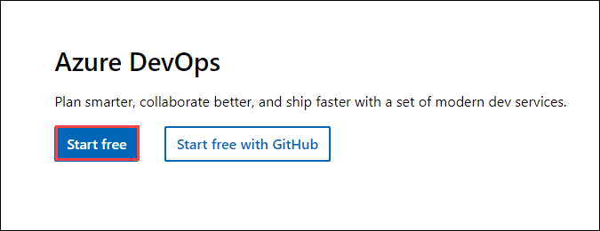
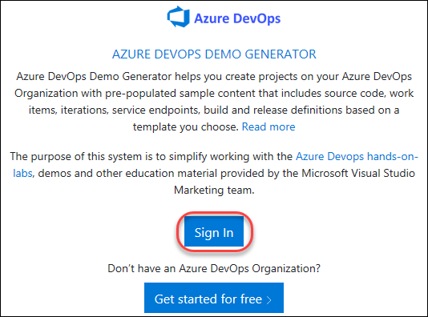
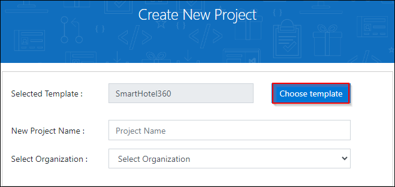
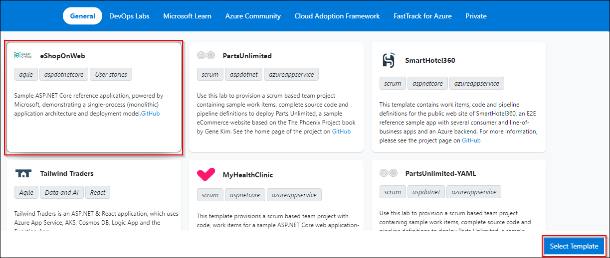
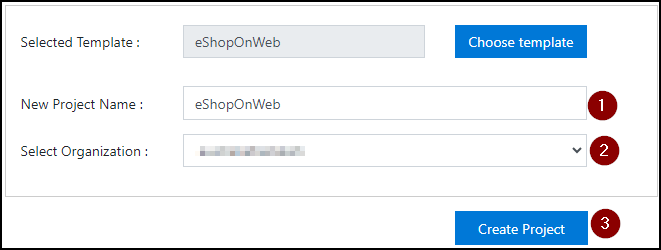
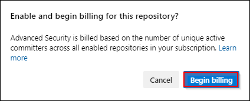

## Lab 01: Configure GHASDO in Azure DevOps

### Task 1: Configuring the eShopOnWeb team project

1. Open Edge browser and navigate to https://dev.azure.com and select **Start Free** and sign in with the credentials provided in the Environment variables.

      

1. On **Get Started with Azure DevOps** page, ensure that Project visibility is set to **Private** and enter the provided **captcha** click on **Continue**

      

1. Navigate to [https://azuredevopsdemogenerator.azurewebsites.net](https://azuredevopsdemogenerator.azurewebsites.net/). This utility site will automate the process of creating a new Azure DevOps project within your account that is prepopulated with content (work items, repos, etc.) required for the lab. For more information on the site, please see [https://docs.microsoft.com/en-us/azure/devops/demo-gen](https://docs.microsoft.com/en-us/azure/devops/demo-gen).

1. Sign in using the Microsoft account associated with your Azure DevOps subscription.

    

1. **Accept** the permission requests for accessing your subscription.

1. Select your Azure DevOps organization and enter the project name **"eShopOnWeb"**. Click **Choose Template**.

    

1. Select the **eShopOnWeb** template and click **Select Template**.

    #Need to update image
    
1. Provide a project name and choose your Organization.

1. Click **Create Project** and wait for the process to complete.

    

1. Navigate to your eShopOnWeb project on Azure DevOps. It will be something like [https://dev.azure.com/YOURACCOUNT/eShopOnWeb]()

### Task 2: Enable Advanced Security from Portal

GitHub Advanced Security for Azure DevOps includes extra permissions for more levels of control around Advanced Security results and management. Be sure to adjust individual permissions for your repository.

To ensure Azure DevOps Advanced Security is enabled in your organization, you can follow these steps:

1. At the **Organization settings** screen click **Billing** (opening this screen takes a few seconds).

1. Click **Setup billing** and on the right-hand side of the screen select the **Existing subscription** listed and click **Save** to link the subscription with the organization.

1. Once the screen shows the linked Azure Subscription ID at the top, change the number of **Paid parallel jobs** for **MS Hosted CI/CD** from 0 to **1**. Then click the **SAVE** button at the bottom.

1. In **Organization Settings**, go to section **Security** and click **Policies**.

1. Toggle the switch to **On** for **Third-party application access via OAuth**
    > Note: The OAuth setting helps enable tools such as the DemoDevOpsGenerator to register extensions. Without this, several labs may fail due to a lack of the required extensions.

1. Toggle the switch to **On** for **Allow public projects**
    > Note: Extensions used in some labs might require a public project to allow using the free version.

1.	Open the **eShopOnWeb** project and click on **Project Settings** available in the lower left corner. In the left menu area under Repos, click **Repositories**.

1.	Click on the **eShopOnWeb** repository.

1.	Click on Settings, then click **Advanced Security**, On to turn it on.

      

1.	Click Begin **Billing**.

      

1.	Advanced Security and Push Protection are now enabled. You can also onboard Advanced Security at [Project-level](https://learn.microsoft.com/en-us/azure/devops/repos/security/configure-github-advanced-security-features?view=azure-devops&tabs=yaml#project-level-onboarding) and [Organization-level](https://learn.microsoft.com/en-us/azure/devops/repos/security/configure-github-advanced-security-features?view=azure-devops&tabs=yaml#organization-level-onboarding) as well
 

   

### Task 3: Setup Advanced Security permissions

In this task, you will configure Advanced Security permissions for the eShopOnWeb repository in Azure DevOps. This involves granting specific permissions to Project Administrators to manage security alerts and settings related to the repository.

1.	In the lower-left corner, click on **Project Settings**. In the left menu area under Repos, click **Repositories**.

1.	Click on the **eShopOnWeb** repository.

1.	Select **Security** and click on **Project Administrators**.

2.	Next to Advanced Security: manage and dismiss alerts, click the dropdown and select  **Allow**.

3.	Next to Advanced Security: manage settings, click the dropdown and select **Allow**.

4.	Next to Advanced Security: view alerts, click the dropdown and select **Allow**.

      

5.	If successful, a green checkmark ✅ appears next to the selected permission.
  

