# Lab 01: Configure GHAzDO in Azure DevOps

## Lab Scenario

In this lab, we configure GitHub Advanced Security (GHAS) within Azure DevOps, enabling enhanced security measures and permissions for the eShopOnWeb project. We set up billing, activate Advanced Security, and establish permissions for managing security alerts.

## Lab Objectives

In this lab, you will perform:
- Task 1: Sign up and configure the eShopOnWeb team project in Azure DevOps
- Task 2: Enable Advanced Security from portal
- Task 3: Setup Advanced Security permissions

## Estimated Timing: 45 minutes

## Architecture Diagram

  

### Task 1: Sign up and configure the eShopOnWeb team project in Azure DevOps

1. Open the **Edge browser**, and navigate to **Azure DevOps** using the link below. Select **Start Free**, and sign in with the credentials provided in the Environment variables.

   ```
    https://dev.azure.com
   ```
      

1. On the **Get Started with Azure DevOps** page, click on **Continue**.

      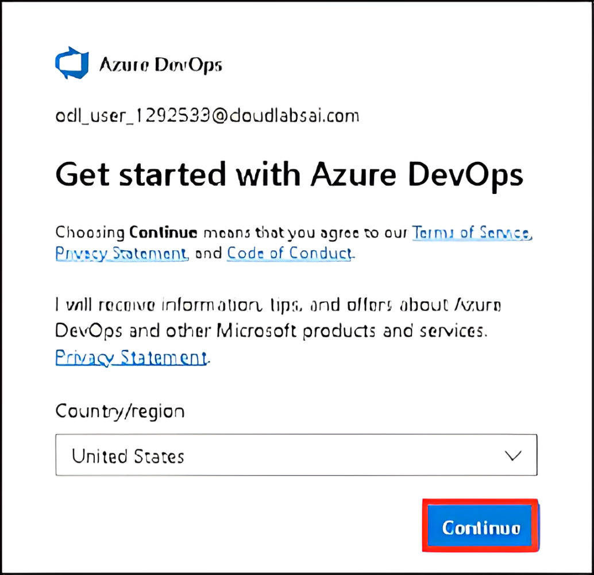

1. On the **Almost done** page, enter the **captcha (1)** and click on **Continue (2)**.

      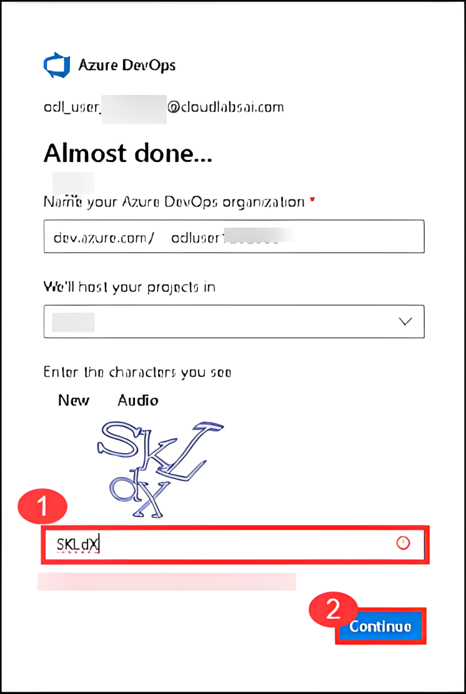

1. On the **Azure DevOps** page, at the button left, click on **Organization settings** (opening this screen takes a few seconds).

    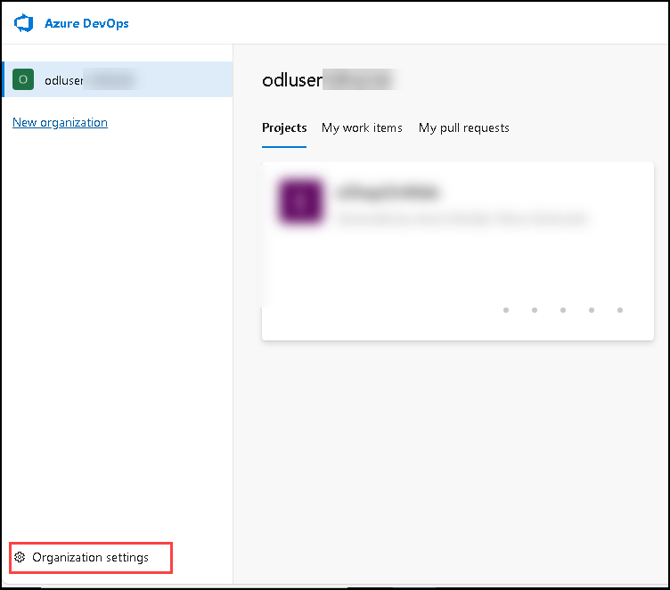

1. From the left navigation pane, select **Billing (1)** and click **Set up billing (2)**. On the right-hand side of the screen, select the **Existing subscription (3)** listed and click **Save (4)** to link the subscription with the organization.

   

   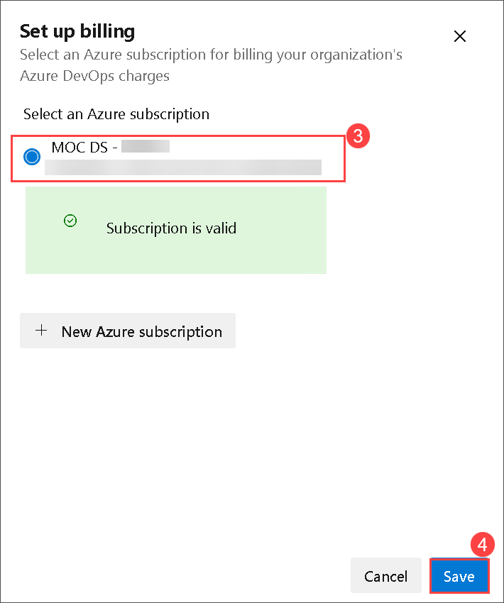

1. Once the screen shows the linked Azure Subscription ID at the top, change the number of **Paid parallel jobs** for **MS Hosted CI/CD** from 0 to **1**. Then click on **Save** button at the bottom.

   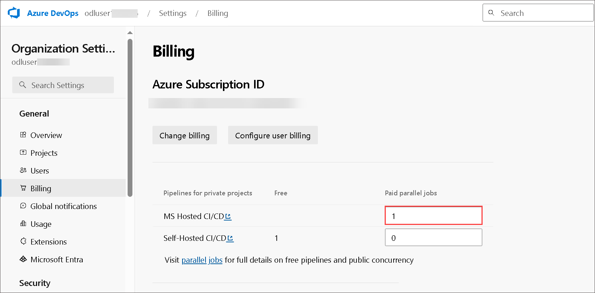

1. On the **Organization Settings** page, go to the Security section and click **Policies (1)**. Enable the toggles for both **Third-party application access via OAuth (2)** and **Allow public projects (3)**, then click **Save (4)** when prompted to Change policy setting.

     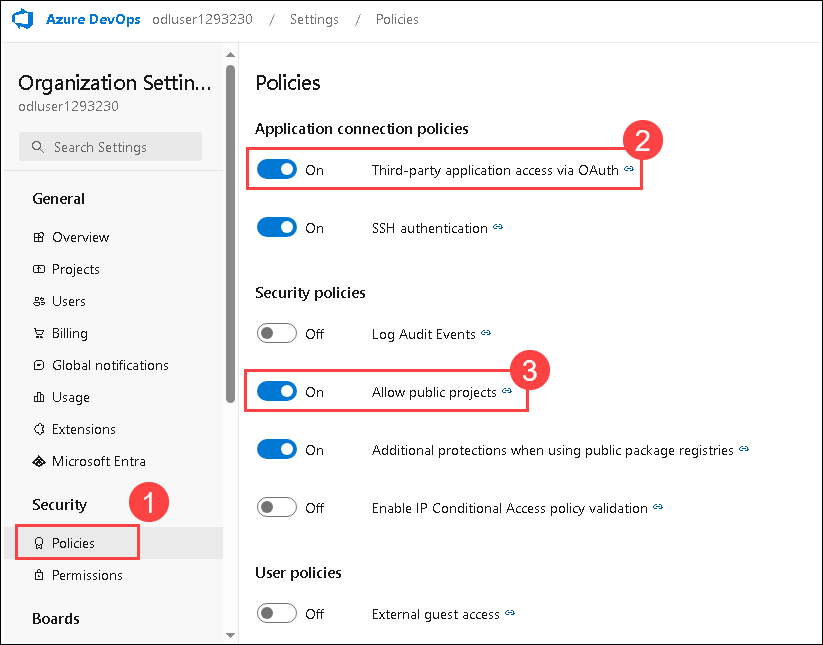
   
      > **Note:** The OAuth setting helps enable tools such as the DemoDevOpsGenerator to register extensions. Without this, several labs may fail due to a lack of the required extensions.

      > **Note:** Extensions used in some labs might require a public project to allow using the free version.

1. Navigate to **azuredevopsdemogenerator** using the link below. This utility site will automate the process of creating a new Azure DevOps project within your account that is prepopulated with content (work items, repos, etc.) required for the lab. For more information on the site, please see [https://docs.microsoft.com/en-us/azure/devops/demo-gen](https://docs.microsoft.com/en-us/azure/devops/demo-gen).

   ```
   https://azuredevopsdemogenerator.azurewebsites.net/
   ```
  
1. Click on **Sign in** and log in using the Microsoft account associated with your Azure DevOps subscription.

    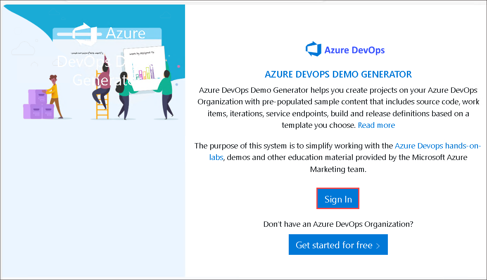

1. Please click on **Accept** to grant permission to access your subscription.

1. Click **Choose Template**.

    

1. Select the **eShopOnWeb (1)** template and click on **Select Template (2)**.

    

1. Provide a project name, **eShopOnWeb (1)**, and choose your **Organization (2)**, then click on **Create Project (3)** and wait for the process to complete.

   

1. Once the process is complete, click on **Navigate to project**.

   

## Create Work item

You can follow these steps to create a work item to link while committing the changes.

1. Navigate to the **eShopOnWeb** project and select **Boards (1)** from the left menu and select **Work items (2)**.

      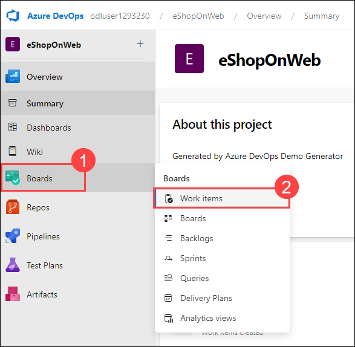

1. On the **Work items** page, select **+ New Work Item (1)** and select **Issue (2)** from the drop-down menu.

      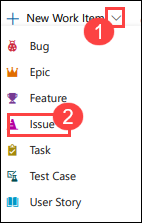

1. Enter **Advanced security related events (1)** in the Title box and enter **Work item to link for all the commits related to Advanced security events (2)** in the description box, and click on **Save (3)**.

      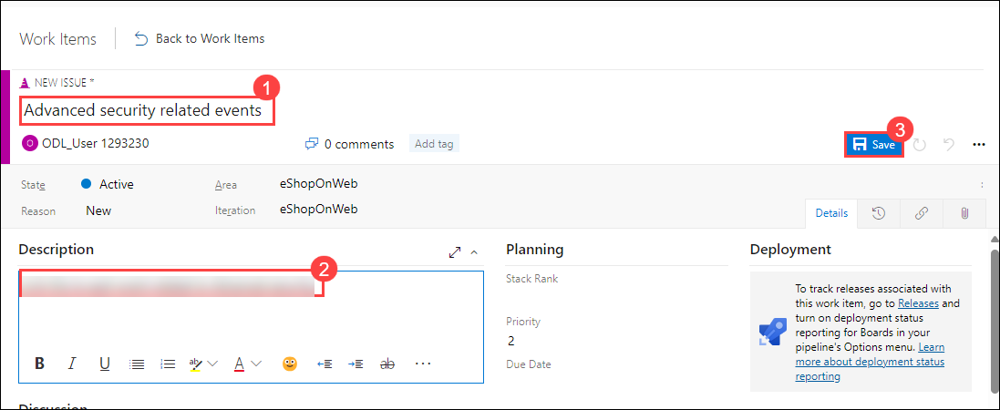

## Create AzDevOps PAT 

In this task, you will create a Personal Access Token (PAT) in Azure DevOps and integrate into our codebase. This integration is essential for testing advanced security functionalities later in the lab.

1. Click on **User settings (1)** and select **Personal access tokens (2)**.

   

1. Select **+ New Token**.

1. On **Create a new personal access token** window, enter the below values and click on **Create (4)**.

    | Setting | Value |
    |----------|-------|
    | Name | **AzDo_PAT (1)** |
    | Scopes | **Custom defined (2)** |
    | Work Items | **Read & write (3)** |

    .png)

1. Once you've generated the token, click on the **Copy** icon to the right of the secret value in the notepad.

   .png)

1. Search **Notepad (1)** using the search box and select the same from suggestions **(2)**.

   .png)

1. Paste the **PAT token** which you copied in step number 4.

   .png)

1. Navigate to **eShopOnWeb** project > **Repos** > **src** > **Web** > and select **Constants.cs** file and click on **Edit**.

   

1. Add **public const string AZ_PAT = "Your-Secret-Value";** to the existing code as shown below. Copy the secret value pasted in the notepad and replace with "Your-Secret-Value" and commit the changes.

   

1. On the **Commit** page, provide the branch name as **addsecret (1)** and link the workitem created earlier **(2)** and click on **Commit (3)**.

   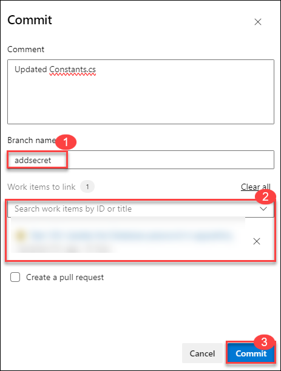

### Task 2: Enable Advanced Security from Portal

GitHub Advanced Security for Azure DevOps includes extra permissions for more levels of control around Advanced Security results and management. Be sure to adjust individual permissions for your repository.

To ensure Azure DevOps Advanced Security is enabled in your organization, you can follow these steps:

1. Click **Project settings (1)** in the lower-left corner. In the left menu under Repos, click **Repositories (2)**, then select the **eShopOnWeb (3)** repository.

   .png)

1. Click on **Settings (1)**, then click on **Advanced Security (2)**, to turn it On.

    .png)

1. Click **Begin Billing**.

    

1. Advanced Security and Push Protection are now enabled. You can also onboard Advanced Security at [Project-level](https://learn.microsoft.com/en-us/azure/devops/repos/security/configure-github-advanced-security-features?view=azure-devops&tabs=yaml#project-level-onboarding) and [Organization-level](https://learn.microsoft.com/en-us/azure/devops/repos/security/configure-github-advanced-security-features?view=azure-devops&tabs=yaml#organization-level-onboarding) as well.

## Update the pipeline and create pull request

In this task, you will remove the azure deployment task codes from the pipeline.

1. Navigate to the **Pipelines (1)** in the left menu and select the **eShopOnWeb (2)** pipeline.

   

1. Click on **Edit**.

   

1. Change the branch to **addsecret**.

   

1. Delete the code in the pipeline which includes the test and production deployments to azure. (from line 70).

1. The final code should look like the below

   ```
    trigger:
    - main
    
    pool:
      vmImage: ubuntu latest
    
    extends: 
      template: template.yaml
      parameters:
        stages:
          - stage: Build
            displayName: 'Build'
            jobs:
            - job: Build
              steps:
              - checkout: self
    
              - task: DotNetCoreCLI@2
                displayName: Restore 
                inputs:
                  command: restore
                  projects: '**/*.csproj'
    
              - task: ms.advancedsecurity-tasks.codeql.init.AdvancedSecurity-Codeql-Init@1
                condition: and(succeeded(), ne(variables['Build.Reason'], 'PullRequest'))
                displayName: 'Initialize CodeQL'
                inputs:
                  languages: csharp
                  querysuite: default
    
              - task: DotNetCoreCLI@2
                displayName: Build
                inputs:
                  projects: '**/*.csproj'
                  arguments: '--configuration $(BuildConfiguration)'
    
              - task: ms.advancedsecurity-tasks.dependency-scanning.AdvancedSecurity-Dependency-Scanning@1
                condition: and(succeeded(), ne(variables['Build.Reason'], 'PullRequest'))
                displayName: 'Dependency Scanning'
    
              - task: ms.advancedsecurity-tasks.codeql.analyze.AdvancedSecurity-Codeql-Analyze@1
                condition: and(succeeded(), ne(variables['Build.Reason'], 'PullRequest'))
                displayName: 'Perform CodeQL analysis'
    
              - task: ms.advancedsecurity-tasks.codeql.enhance.AdvancedSecurity-Publish@1
                condition: and(succeeded(), ne(variables['Build.Reason'], 'PullRequest'))
                displayName: 'Publish Results'
    
              - task: DotNetCoreCLI@2
                displayName: Test
                inputs:
                  command: test
                  projects: '[Tt]ests/**/*.csproj'
                  arguments: '--configuration $(BuildConfiguration) --collect:"Code coverage"'
    
              - task: DotNetCoreCLI@2
                displayName: Publish
                inputs:
                  command: publish
                  publishWebProjects: True
                  arguments: '--configuration $(BuildConfiguration) --output $(build.artifactstagingdirectory)'
                  zipAfterPublish: True
    
              - task: PublishBuildArtifacts@1
                displayName: 'Publish Artifact'
                inputs:
                  PathtoPublish: '$(build.artifactstagingdirectory)'
                condition: succeededOrFailed()
    ```
     
1. Click on **Validate and save**.

   

1. Click on **Save**.

   

1. Navigate to **Repos (1)** > **Pull requests (2)** and click on **Create a Pull request (3)**.

   

1. For the title, enter the **added secret** and click on **Create**. This will run the eShoponWeb pipeline to validate changes.

1. Once the eShoponWeb pipeline has been completed, click **Approve**, and then click on **Complete** and click on **Complete merge**.

### Task 3: Setup Advanced Security permissions

In this task, you will configure advanced security permissions for the eShopOnWeb repository in Azure DevOps. This involves granting specific permissions to project administrators to manage security alerts and settings related to the repository.

1. Click **Project settings (1)** in the lower-left corner. In the left menu under Repos, click **Repositories (2)**, then select the **eShopOnWeb (3)** repository.

      .png)

1. Select **Security (1)** and click on **Project Administrators (2)**.

1. Next to Advanced Security: manage and dismiss alerts, click the **dropdown**, and select  **Allow**.

1. Next to Advanced Security: manage settings, click the **dropdown**, and select **Allow**.

1. Next to Advanced Security: view alerts, click the dropdown, and select **Allow**.

      .png)

1. Make sure a green checkmark ✅ appears next to the selected permission.

Please feel free to go through the documentation for further understanding: [GitHub Advanced Security for Azure DevOps](https://azure.microsoft.com/en-us/products/devops/github-advanced-security) and [Configure GitHub Advanced Security for Azure DevOps](https://learn.microsoft.com/en-us/azure/devops/repos/security/configure-github-advanced-security-features?view=azure-devops&tabs=yaml)

## Review
In this lab, you have completed the following:

- Configured the eShopOnWeb team project.
- Enabled Advanced Security from the Portal.
- Set up Advanced Security permissions.

Click on **Next** to proceed with the next lab.
