# Lab 01: Configuring GitHub Advanced Security in Azure DevOps 

## Lab Scenario

In this lab, we configure GitHub Advanced Security (GHAS) within Azure DevOps, enabling enhanced security measures and permissions for the eShopOnWeb project. We set up billing, activate Advanced Security, and establish permissions for managing security alerts.

## Lab Objectives

In this lab, you will perform:
- Task 1: Sign up and configure the eShopOnWeb team project in Azure DevOps
- Task 2: Enable Advanced Security from the portal
- Task 3: Understand and Manage Advanced Security Permissions

## Estimated Timing: 45 minutes

## Architecture Diagram

  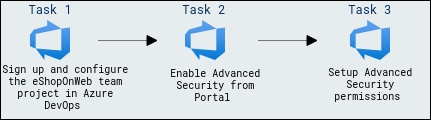

## Task 1: Sign up and configure the eShopOnWeb team project in Azure DevOps

1. Open the **Edge browser**, and navigate to **Azure DevOps** using the link below. Select **Start Free**, and sign in with the credentials provided in the Environment variables.

   ```
    https://dev.azure.com
   ```
      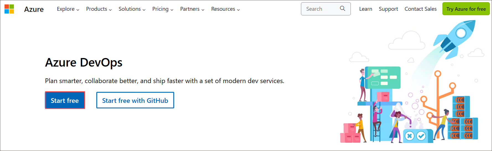

1. You'll see the **Sign into Microsoft Azure** tab. Here, enter your credentials:
 
   - **Email/Username:** <inject key="AzureAdUserEmail"></inject>
 
   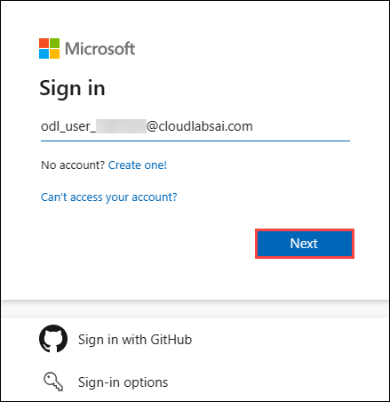
 
1. Next, provide your password:
 
   - **Password:** <inject key="AzureAdUserPassword"></inject>
 
   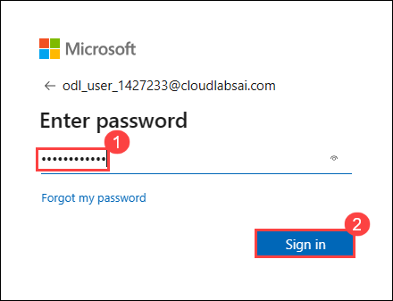
 
1. If prompted to stay signed in, you can click **Yes**.

      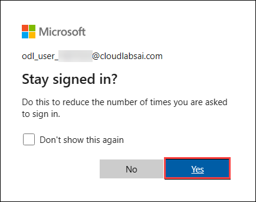

1. On the **Get Started with Azure DevOps** page, click on **Continue**.

      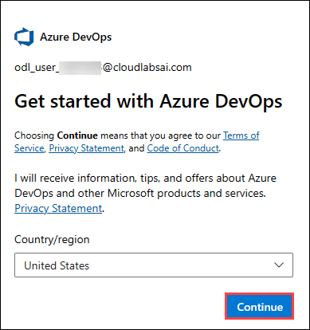

1. On the **Almost done** page, enter the **captcha (1)** and click on **Continue (2)**.

      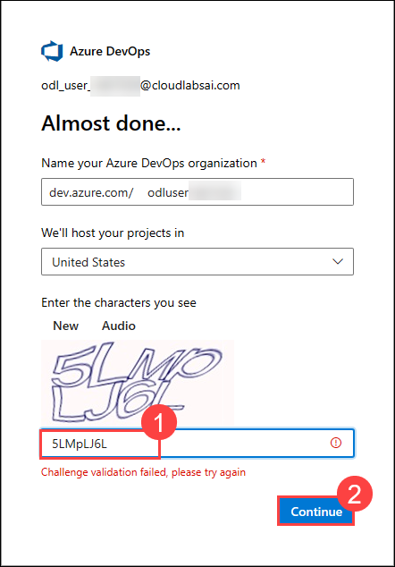

1. On the **Azure DevOps** page, at the button left, click on **Organization settings** (opening this screen takes a few seconds).

    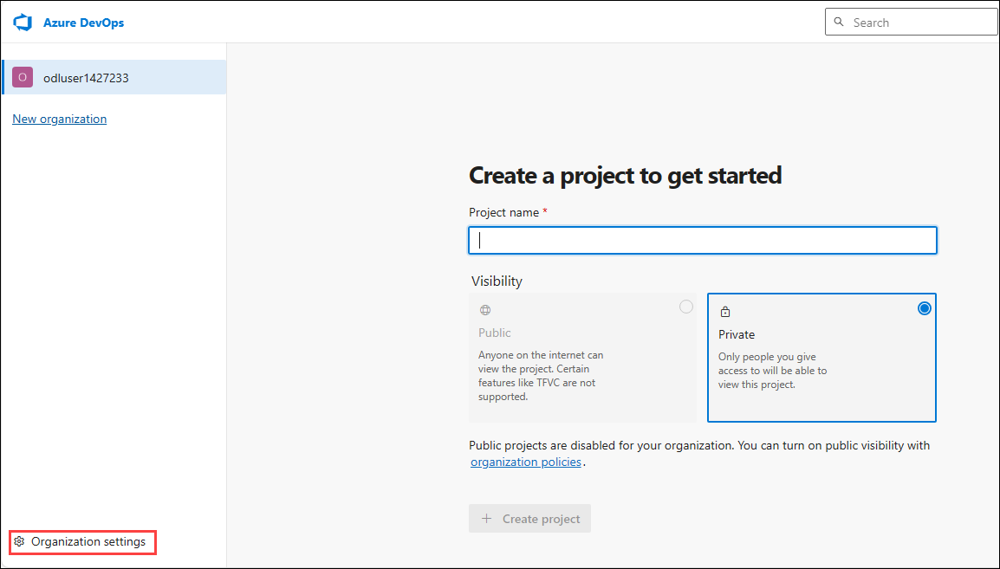

1. From the left navigation pane, select **Billing (1)** and click **Set up billing (2)**. On the right-hand side of the screen, select the **Existing subscription (3)** listed and click **Save (4)** to link the subscription with the organization.

   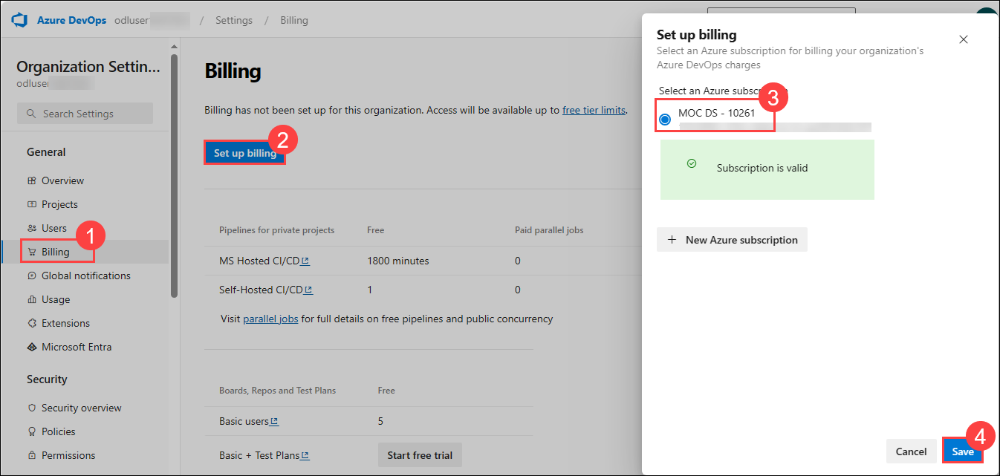

1. Once the screen shows the linked Azure Subscription ID at the top, change the number of **Paid parallel jobs** for **MS Hosted CI/CD** from 0 to **1**. Then click on the **Save** button at the bottom.

   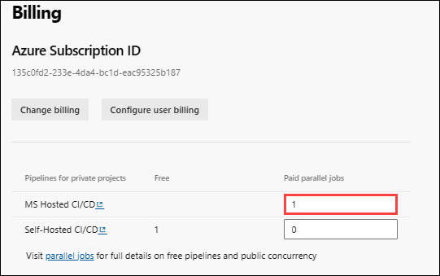

1. On the **Organization Settings** page, go to the Security section and click **Policies (1)**. Enable the toggles for both **Third-party application access via OAuth (2)** and **Allow public projects (3)**, then click **Save (4)** when prompted to Change policy setting.

     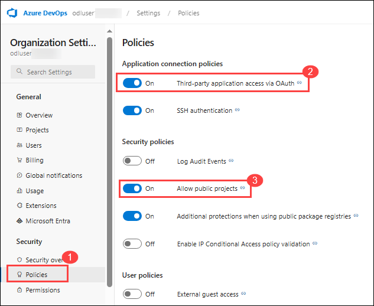
   
      > **Note:** The OAuth setting helps enable tools such as the DemoDevOpsGenerator to register extensions. Without this, several labs may fail due to a lack of the required extensions.

      > **Note:** Extensions used in some labs might require a public project to allow using the free version.

1. Navigate to **azuredevopsdemogenerator** using the link below. This utility site will automate the process of creating a new Azure DevOps project within your account that is prepopulated with content (work items, repos, etc.) required for the lab. For more information on the site, please see [https://docs.microsoft.com/en-us/azure/devops/demo-gen](https://docs.microsoft.com/en-us/azure/devops/demo-gen).

   ```
   https://azuredevopsdemogenerator.azurewebsites.net/
   ```
  
1. Click on **Sign in** and log in using the Microsoft account associated with your Azure DevOps subscription.

    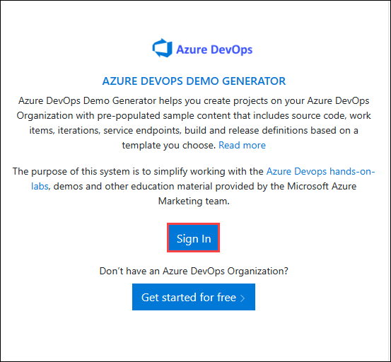

1. Please click on **Accept** to grant permission to access your subscription.

    

1. Click **Choose Template**.

    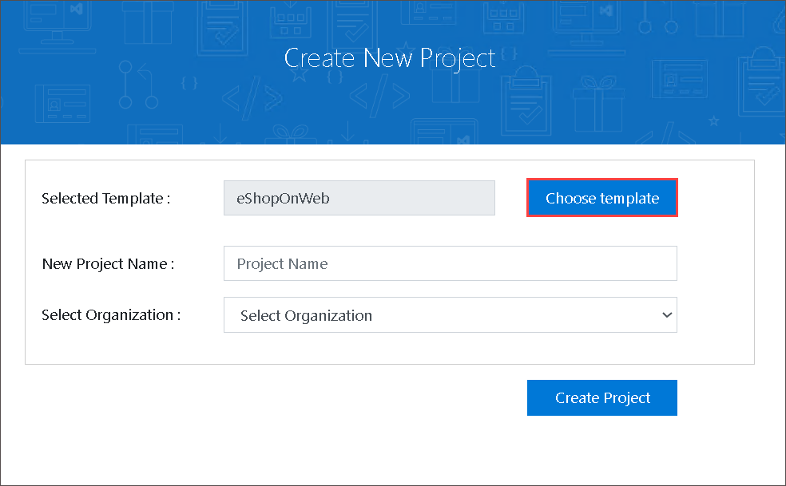

1. Select the **eShopOnWeb (1)** template and click on **Select Template (2)**.

    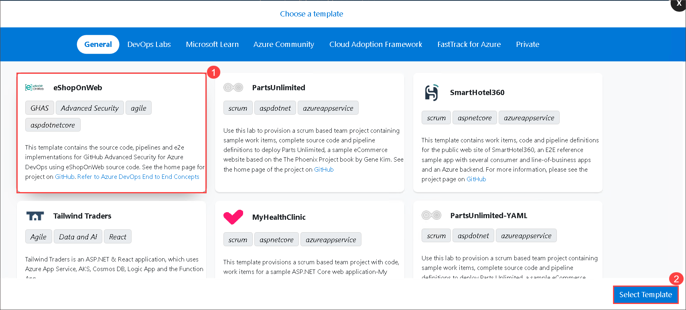

1. Provide a project name, **eShopOnWeb (1)**, and choose your **Organization (2)**, then click on **Create Project (3)** and wait for the process to complete.

   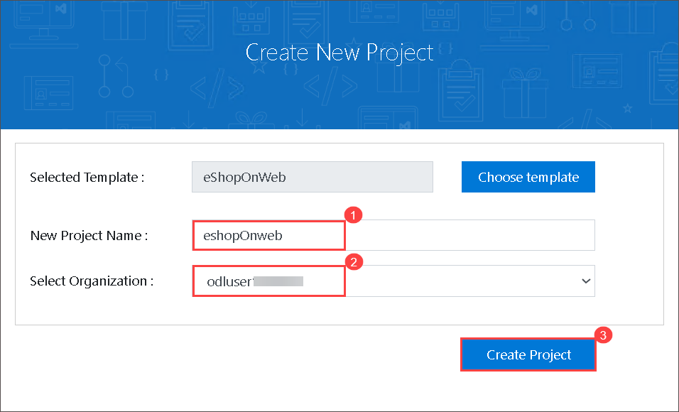

1. Once the process is complete, click on **Navigate to project**.

   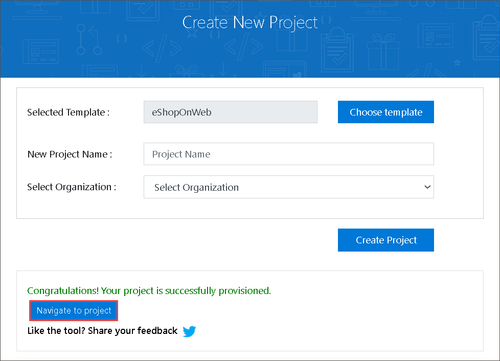

### Remove Branch Policy

This task is being carried out to facilitate a seamless workflow during testing in the lab environment. However, please note that in a production environment, it is recommended to enable this policy as a best practice as its always good to link you PR to the work items that is created for any specific items.

1. Navigate to the **eShopOnWeb** project and select **Repos** from the left menu.

      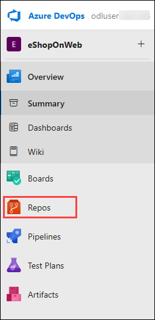

1. Navigate to **Branches** menu and select **Branch Policies** for the Main branch.

      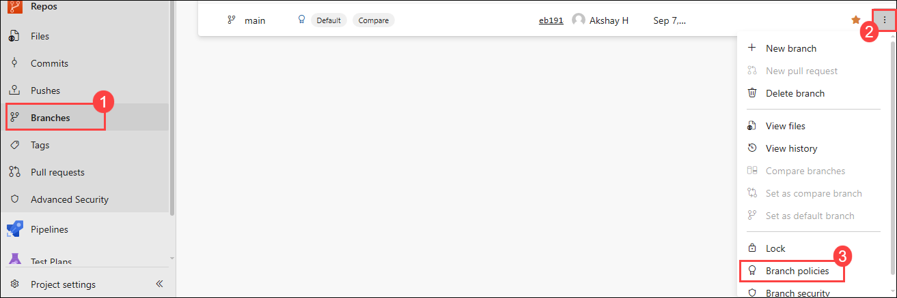

1. Turn **Off** the check for linked work items policy

      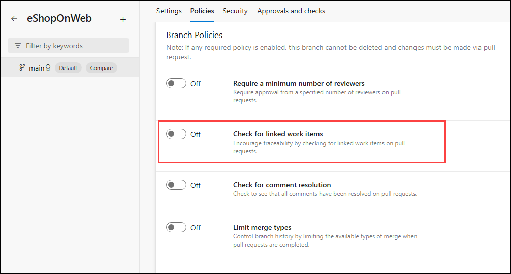

This action will remove the requirement for linking work items when working with branches in the lab environment.

### Create Azure DevOps - Personal Access Token 

In this task, you will create a Personal Access Token (PAT) in Azure DevOps and integrate it into our codebase. This integration is essential for testing advanced security functionalities later in the lab and to demonstrate how the advance security functionality works and detect any security threat.

1. Click on **User settings (1)** and select **Personal access tokens (2)**.

   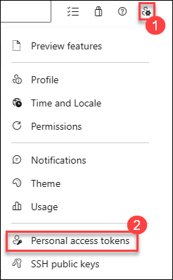

1. Select **+ New Token**.

1. On **Create a new personal access token** window, enter the below values and click on **Create (4)**.

    | Setting | Value |
    |----------|-------|
    | Name | **AzDo_PAT (1)** |
    | Scopes | **Custom defined (2)** |
    | Work Items | **Read & write (3)** |

    .png)

1. Once you've generated the token, click on the **Copy** icon to the right of the secret value in the notepad.

   .png)

1. You can copy the PAT in a Notepad window or open a new tab, navigate to the eShopOnWeb project, and paste the PAT token as described in the below step.

1. Navigate to **eShopOnWeb** project > **Repos** > **src** > **Web** > and select **Constants.cs** file and click on **Edit**.

   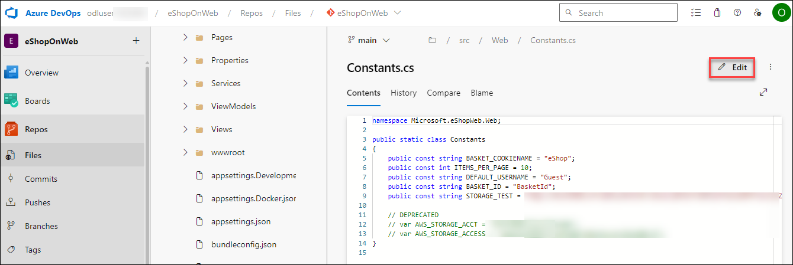

1. Add **public const string AZ_PAT = "Your-Secret-Value";** to the existing code as shown below. Replace "Your-Secret-Value" with your PAT token, and **commit** the changes.

   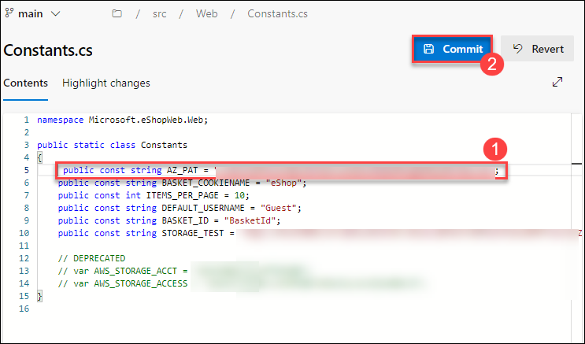

1. On the **Commit** page, provide the branch name as **addsecret (1)** and click on **Commit (2)**.

   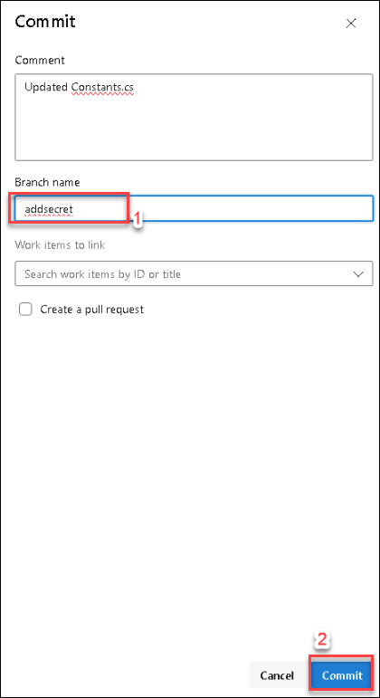

  >**Note**: You were able to add the secret value directly to the code without any issues, which emphasizes that the advanced security feature is not yet enabled. We will be enabling it in the next step and you will be able to see the advance security feature in action. 

## Task 2: Enable Advanced Security from Portal

GitHub Advanced Security for Azure DevOps includes extra permissions for more levels of control around Advanced Security results and management. Be sure to adjust individual permissions for your repository.

To ensure Azure DevOps Advanced Security is enabled in your organization, you can follow these steps:

1. Click **Project settings (1)** in the lower-left corner. In the left menu under Repos, click **Repositories (2)**, then select the **eShopOnWeb (3)** repository.

   .png)

1. Click on **Settings (1)**, then click on **Advanced Security (2)**, to turn it On.

    .png)

1. Click **Begin Billing**.

    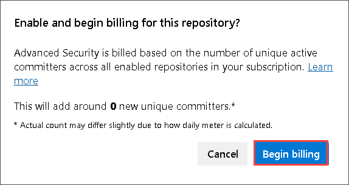

1. Advanced Security and Push Protection are now enabled. You can also onboard Advanced Security at [Project-level](https://learn.microsoft.com/en-us/azure/devops/repos/security/configure-github-advanced-security-features?view=azure-devops&tabs=yaml#project-level-onboarding) and [Organization-level](https://learn.microsoft.com/en-us/azure/devops/repos/security/configure-github-advanced-security-features?view=azure-devops&tabs=yaml#organization-level-onboarding) as well but we recommend for this hands on lab to enable it only for repositry level.

### Update the DevOps pipeline to include Advance security tasks and create a pull request to initiate scan.

In this task, you will update the pipeline to include Advances security dependency scanning and CodeQL analysis tasks, and create a pull request to merge these changes, initializing the dependency and code scanning capabilities for the repository.

1. Navigate to the **Pipelines (1)** in the left menu and select the **eShopOnWeb (2)** pipeline.

   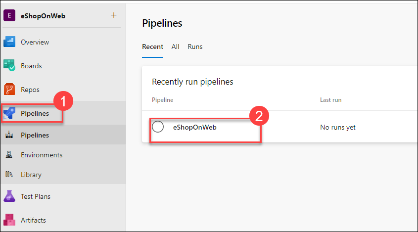

1. Click on **Edit** on top right corner.

   

1. Change the branch to **addsecret** that you have created while commiting the previous changes  .

   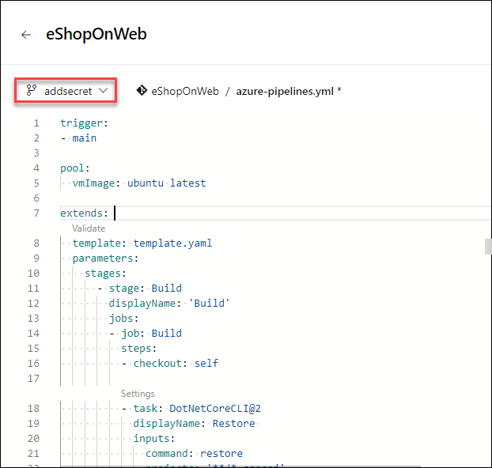

1. Remove the existing code in the pipeline and add the below code

   ```yaml
    trigger:
    - main
    
    pool:
      vmImage: ubuntu latest
    
    extends: 
      template: template.yaml
      parameters:
        stages:
          - stage: Build
            displayName: 'Build'
            jobs:
            - job: Build
              steps:
              - checkout: self
    
              - task: DotNetCoreCLI@2
                displayName: Restore 
                inputs:
                  command: restore
                  projects: '**/*.csproj'
    
              - task: AdvancedSecurity-Codeql-Init@1
                condition: and(succeeded(), ne(variables['Build.Reason'], 'PullRequest'))
                displayName: 'Initialize CodeQL'
                inputs:
                  languages: csharp
                  querysuite: default
    
              - task: DotNetCoreCLI@2
                displayName: Build
                inputs:
                  projects: '**/*.csproj'
                  arguments: '--configuration $(BuildConfiguration)'
    
              - task: AdvancedSecurity-Dependency-Scanning@1
                condition: and(succeeded(), ne(variables['Build.Reason'], 'PullRequest'))
                displayName: 'Dependency Scanning'
    
              - task: AdvancedSecurity-Codeql-Analyze@1
                condition: and(succeeded(), ne(variables['Build.Reason'], 'PullRequest'))
                displayName: 'Perform CodeQL analysis'
    
              - task: AdvancedSecurity-Publish@1
                condition: and(succeeded(), ne(variables['Build.Reason'], 'PullRequest'))
                displayName: 'Publish Results'
    
              - task: DotNetCoreCLI@2
                displayName: Test
                inputs:
                  command: test
                  projects: '[Tt]ests/**/*.csproj'
                  arguments: '--configuration $(BuildConfiguration) --collect:"Code coverage"'
    
              - task: DotNetCoreCLI@2
                displayName: Publish
                inputs:
                  command: publish
                  publishWebProjects: True
                  arguments: '--configuration $(BuildConfiguration) --output $(build.artifactstagingdirectory)'
                  zipAfterPublish: True
    
              - task: PublishBuildArtifacts@1
                displayName: 'Publish Artifact'
                inputs:
                  PathtoPublish: '$(build.artifactstagingdirectory)'
                condition: succeededOrFailed()

      ```
     
1. Click on **Validate and save**.

   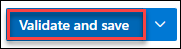

1. Click on **Save**, we will be pusing the changes to the previously created branch **addsecret** only.

   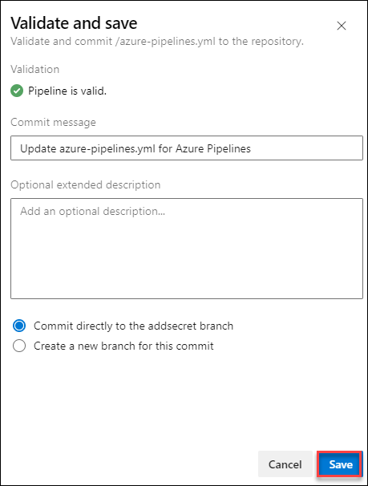

1. Navigate to **Repos (1)** > **Pull requests (2)** and click on **Create a Pull request (3)**, you will see already a tab mentioning the latest changes.

   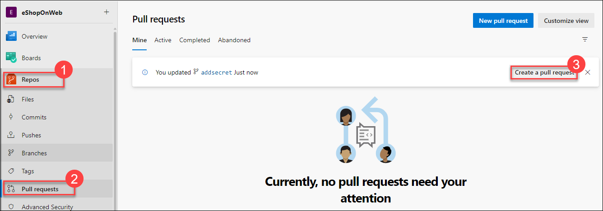

1. For the title, enter the **added secret and updated pipeline** and click on **Create**. This will run the eShoponWeb pipeline to validate changes.
 
   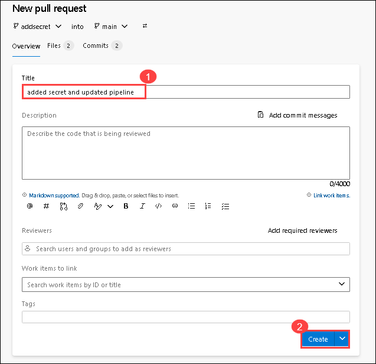buildscs
   
1. Once the eShoponWeb pipeline has been completed, click **Approve**, and then click on **Complete** and click on **Complete merge**.
  
   > **Note:** The pipeline execution can take approx. 5 minutes to get complete, please wait untill the build gets completed and then click on Complete merge. If you want to see the actual progress of pipeline, you can click on eShopOnWeb (Build in progress) button under overview section
   
   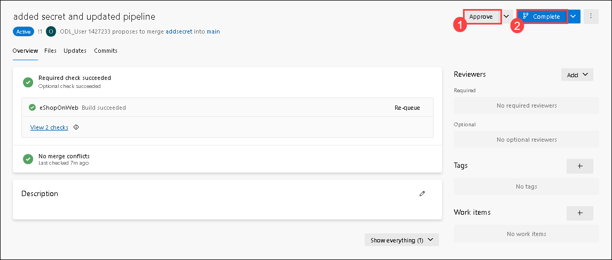

   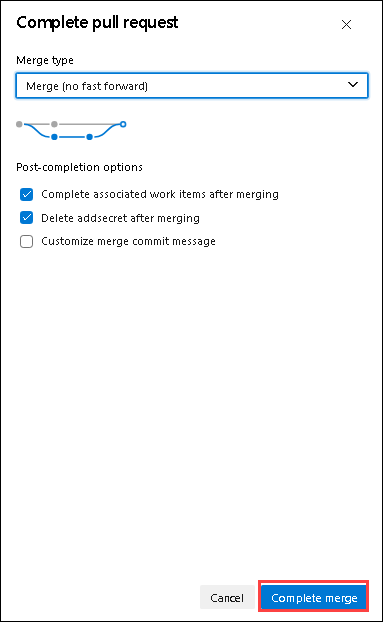

1. Once the pipeline merges, Navigate to pipeline section from the lab side menu and select the newly running pipeline on merging the branch to main.

   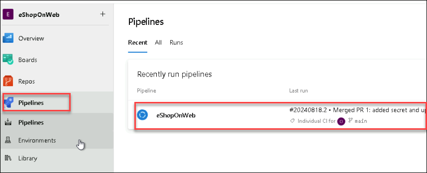

1. Select the latest pipeline run, tagging to the PR description (Added secret and updated pipeline.) and select running **build** from bottom. You will be able to see the vulnerabilities that are selected by the advanced security tasks that we have added in previous steps.

   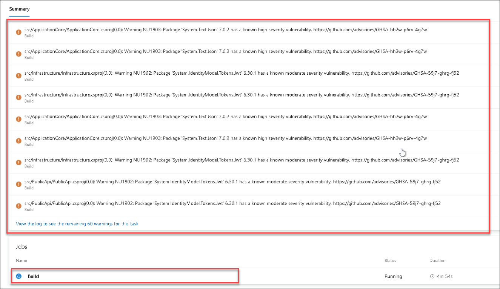

1. You can also see how each task is categorized in pipeline run and you can expant to see the actual raw results. 

## Task 3: Understand and Manage Advanced Security Permissions

In this task, you'll learn about the advanced security permissions available for the eShopOnWeb repository in Azure DevOps. While Project Administrators typically have the necessary permissions to manage security settings, understanding these permissions is important for scenarios where adjustments might be necessary.

### Overview of Advanced Security Permissions

Azure DevOps provides advanced security features that allow you to manage and monitor the security of your repository. Here are the key permissions:

1. **Manage and dismiss alerts:** This permission allows users to handle security alerts generated by advanced security tools. Typically, this is used by security teams to address potential vulnerabilities or issues flagged in the codebase.

2. **Manage settings:** This permission enables users to configure and adjust security settings for the repository. While Project Administrators generally have this permission by default, there might be scenarios where it is delegated to specific security-focused roles.

3. **View alerts:** This permission allows users to view security alerts without the ability to manage them. This might be useful for auditors or other roles that need to monitor security without making changes.

### When to Adjust Permissions

While Project Administrators generally do not need to adjust their own permissions, there are scenarios where it might be necessary to modify these settings:

- **Delegation to Security Teams:** In larger organizations, security teams might be assigned specific roles within a project. In such cases, you might adjust permissions to give these teams control over managing and dismissing alerts without full administrative rights.
  
- **Auditing and Compliance:** If your organization requires strict auditing or compliance controls, you might grant specific users or groups the ability to view alerts without granting them the power to manage settings or dismiss alerts.

### How to Access, Review, and Set Security Settings

1. Click **Project settings (1)** in the lower-left corner. In the left menu under Repos, click **Repositories (2)**, then select the **eShopOnWeb (3)** repository.

      .png)

1. Select **Security (1)** and click on **Project Administrators (2)**.

1. Next to Advanced Security: manage and dismiss alerts, click the **dropdown**, and select  **Allow**.

1. Next to Advanced Security: manage settings, click the **dropdown**, and select **Allow**.

1. Next to Advanced Security: view alerts, click the dropdown, and select **Allow**.

      .png)

1. Make sure a green checkmark ✅ appears next to the selected permission.

For detailed guidance on configuring these settings, refer to the following documentation:
- [GitHub Advanced Security for Azure DevOps](https://azure.microsoft.com/en-us/products/devops/github-advanced-security)
- [Configure GitHub Advanced Security for Azure DevOps](https://learn.microsoft.com/en-us/azure/devops/repos/security/configure-github-advanced-security-features?view=azure-devops&tabs=yaml)
- [Advanced Security Billing](https://learn.microsoft.com/en-us/azure/devops/repos/security/github-advanced-security-billing?view=azure-devops)

## Review
In this lab, you have completed the following:

- Configured the eShopOnWeb team project.
- Enabled Advanced Security from the Portal.
- Understand and Manage Advanced Security Permissions

Click on **Next** to proceed with the next lab.
