# Lab 02: Secret Scanning 
### Estimated Duration: 30 minutes

In this lab, we implement secret scanning in Azure DevOps to identify and mitigate potential exposures. We learn to view, fix, and dismiss secret scanning alerts, enhancing security measures within their development environment.

## Lab Objectives

In this lab, you will perform the following:

- Task 1: Viewing alerts of the repository
- Task 2: Fixing secret scanning alerts
- Task 3: Dismissing secret scanning alerts

<!-- 
## Architecture Diagram

  
   -->
Secret Scanning scans your codebase and other resources to identify potential secrets that may have been inadvertently committed and provides alerts to mitigate the risk of exposure. Push protection also prevents credentials from being leaked in the first place.

Once this is toggled on, it starts off a background scan of this repo and looks for exposed credentials. The scan doesn't just look at the tip of the main, since attackers would look through all the branches and the entire commit history.

### Task 1: Viewing alerts of repository

The Advanced Security Alert Hub is where all alerts are raised and where we gain insights, specifically under the category of Secrets. When a secret is found, you can click on it to access more information. The secret may be located in different places, including various commits. 
   
1. Go to the **Repos** tab from left side menu and click on the **Advanced Security** menu item at the bottom.

   

1. Click on **Secrets (1)** to see a list of all the exposed secret alerts that have been found. This includes the alert and introduced dates. Click on the **Azure DevOps identifiable personal access token (PAT) (2)** to see more details about the alert and what you can do to clean up the secret.

   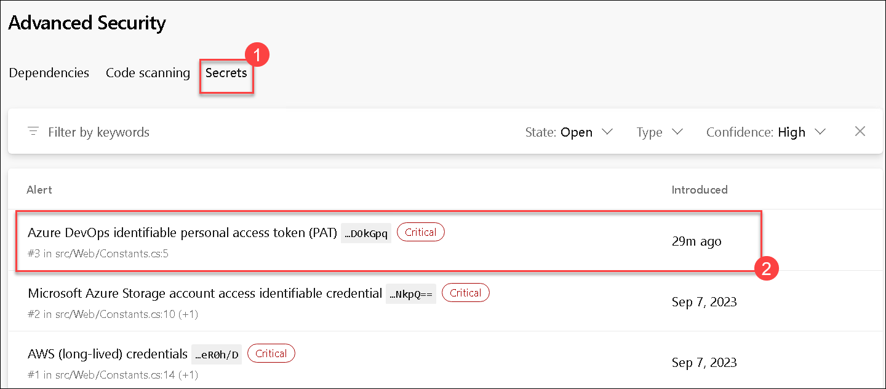

1. Notice that this includes the Recommendation, Locations found, Remediation steps, Severity, and the Date it was first introduced. We can easily clean this up and dismiss the alert.

   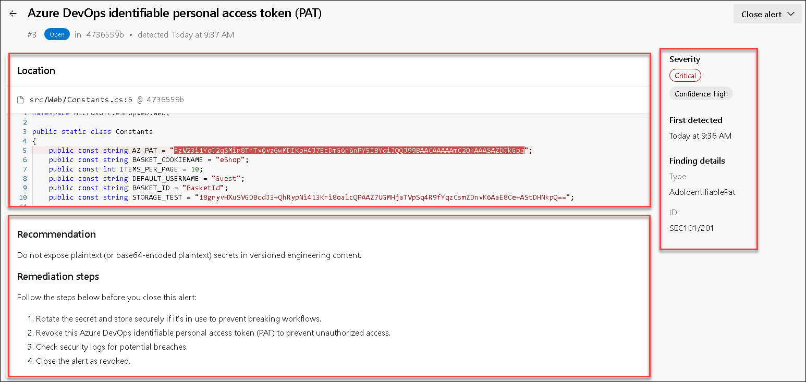

### Task 2: Checking push protection and Fixing secret scanning alerts

Once a credential touches the repo, it's too late. Hackers might have already exploited it. The only way forward is to permanently eliminate these leaks and find all the places they're being used in production.

 **Note:** Good news! GHAzDO focuses on preventing this in the first place. Bad news! These need to be manually fixed. There isn't an easy button.

#### Push Protection demonstration

Push Protection helps protect your repository by preventing unauthorized or malicious code from being pushed to your repository's branches.

You can follow these steps to update a file. 

1. While viewing the alert details, click on the line of code, _Constants._ _cs_.

    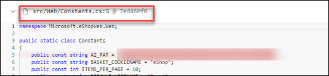

1. Click on **Edit** to edit the file. This will open the code editor and highlight the exact location of the secret. In this case, it's in the .cs file.

   .png)

1. On line 5, update the variable name to **AZDO_PAT (1)**, then click **Commit (2)** to save the changes.
    
     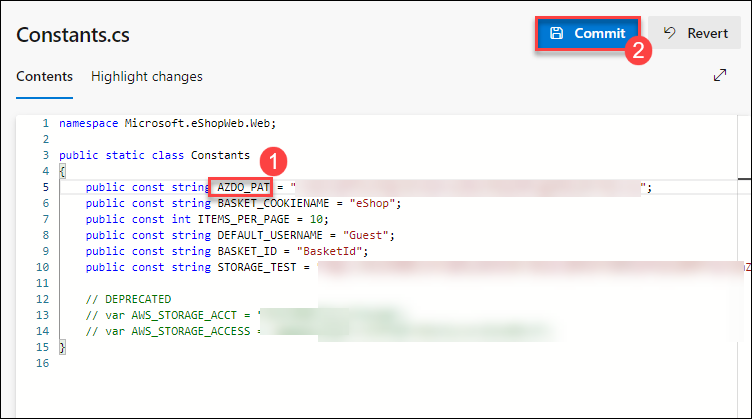

1. Enter **PATDetails (1)** for the branch name and then click on **Commit (2)** again.

     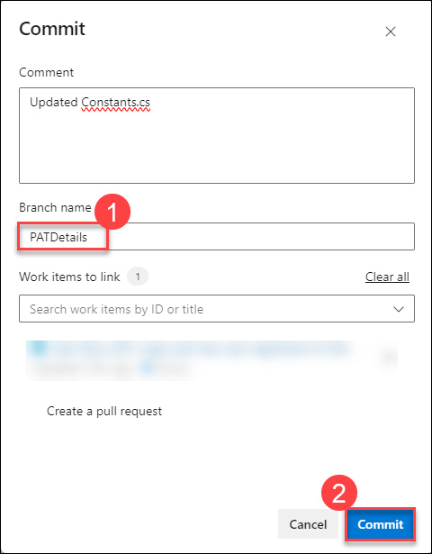

1. The commit was rejected because the repository has secret protection enabled. This is a good thing! It's preventing us from checking in on the exposed secret. Let's fix this.
   
    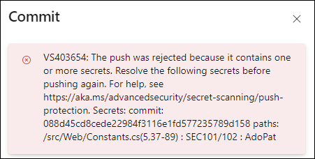

    > **Note:** The code went up to the server, was analyzed, rejected, and not stored anywhere. Using Secret push scanning, it catches secrets right before they become a problem.

    > **ProTip!** This can't happen during a Pull Request. Once the code has been pushed into a topic branch, it's too late. PR analysis is best for dependency scanning but not secret push scanning. They are different.

#### Bypass push protection

Bypass push protection in Azure DevOps allows developers to override security checks that prevent sensitive data from being pushed to a repository. This feature should be used cautiously, typically when dealing with false positives or urgent changes that need immediate deployment. In Azure DevOps, setting **skip-secret-scanning:true** in your pipeline allows you to bypass secret scanning checks, enabling you to push changes without triggering security blocks related to sensitive data detection.

1. Update your comment with **skip-secret-scanning:true** and click **Commit**.

    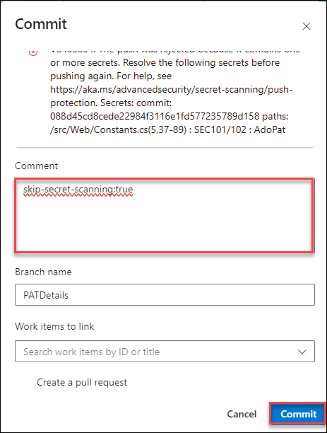

    >**Note:** Bypassing flagged secrets isn't recommended because bypassing can put a company’s security at risk.

#### Fixing Exposed Secrets

Fixing exposed secrets in Azure DevOps involves revoking or rotating the compromised secret, removing it from the codebase, and updating the code to use secure storage like Azure Key Vault. Additionally, you may need to clean the commit history and enhance security measures to prevent future exposures.

You can follow the below steps to fix the exposed secret. 

1. Click on **Edit**.

    > **Note**: This scenario is all too common. Developers often forget to remove the connection string from the appsettings.json file when testing an application, exposing the secret in the repo and allowing exposed credentials to remain in history, resulting in a significant security hole. This is a common issue when testing local applications.

    .png)

1. On line 5, replace the whole line to **public static readonly string AZDO_PAT = Environment.GetEnvironmentVariable("AZ_PAT"); (1)**, then click **Commit (2)** to save the changes.

   > **Note:** You can learn more about using the Envrionment variables with Azure DevOps pipeline [here](https://learn.microsoft.com/en-us/azure/devops/pipelines/process/variables?view=azure-devops&tabs=yaml%2Cbatch) as this lab is more focusing on Advanced securities of Azure DevOps.
    
     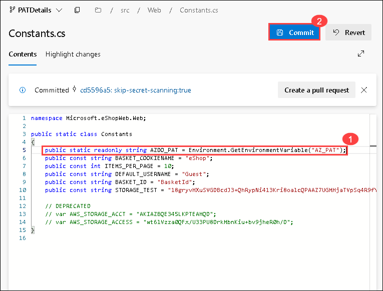

1. Enter **PATFIX (1)** for the branch name and then click on **Commit (2)** again.

     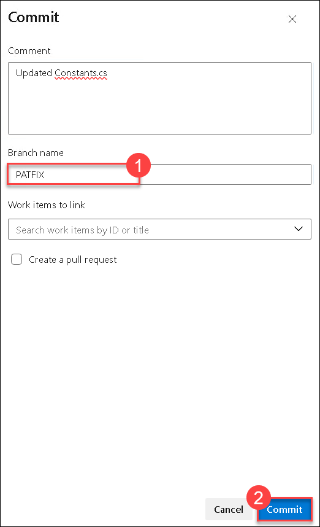

    > **Note:** This step is necessary since the main branch is protected by a pull request pipeline.

1. Now, lets regenerate the PAT as the old secret key is already exposed and its necessary to regenrate or delete the PAT to avoid security risk. Navigate to **User settings (1)** > **Personal access token (2)**.

   .png)

1. Select the existing token and select **Regenerate** twice and **copy** the token value, then open a new tab and continue with the next step..

    

    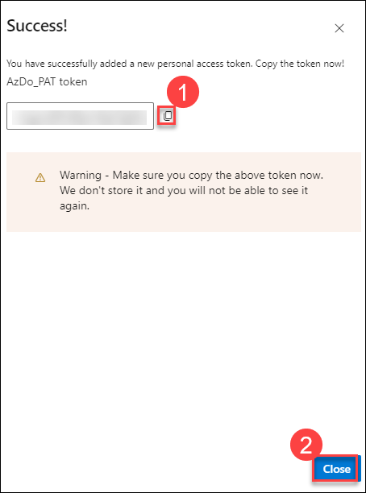

   >**Note**: In this lab, we have deliberately avoided creating the AZ_PAT environment variable because it is not required for the exercise. However, in real scenarios, you would set up this variable in the pipeline after regenerating the PAT.

1. Now lets raise the PR and merge the changes to main branch, click on **Repos (1)** from left side menu, click **Pull Requests (2)**, and click on **Create a pull request (3)** to merge the changes from branch **PATFIX** into branch **main**. 

    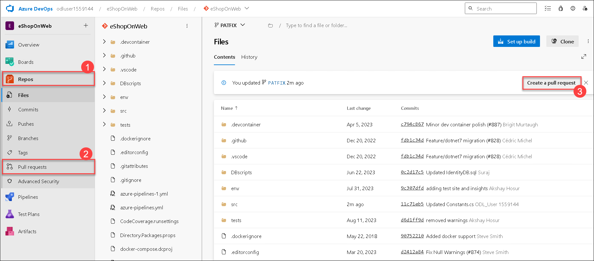

1. For the title, enter the **Fixed secret (2)** and click on **Create (3)**. This will run the **eShoponWeb** pipeline to validate changes. 

    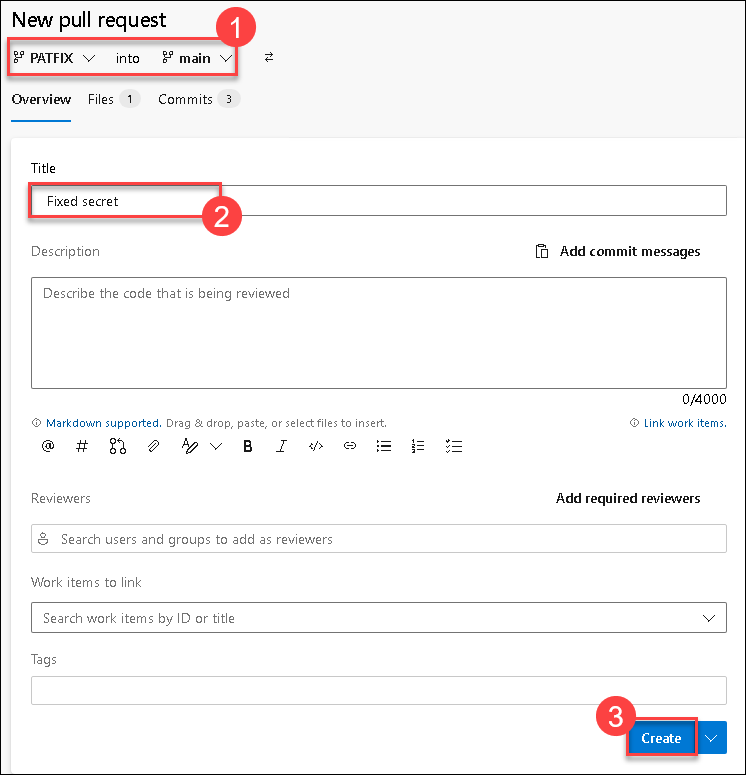

1. Once the **eShoponWeb** pipeline run has been completed, click **Approve**, and then click on **Complete**.

   > **Note:** The pipeline execution can take approx. 5 minutes to get complete, please wait untill the build gets completed and then click on Complete merge.

1. On **Complete pull request** page, leave all option to default and click on **Complete merge** button to merge changes into the main branch.

    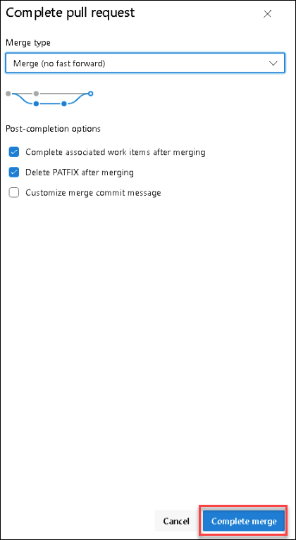

> **Congratulations** on completing the task! Now, it's time to validate it. Here are the steps:
> - If you receive a success message, you can proceed to the next task.
> - If not, carefully read the error message and retry the step, following the instructions in the lab guide. 
> - If you need any assistance, please contact us at **cloudlabs-support@spektrasystems.com**. We are available 24/7 to help you out.

<validation step="850d5a53-dfa3-456c-a94d-9e081b2185cf" />

### Task 3: Dismissing secret scanning alerts

Dismissing secret scanning alerts in Azure DevOps allows you to acknowledge and suppress alerts for specific false positives or non-sensitive data, preventing them from triggering security warnings in future scans.

You can follow the below steps to dismiss the alert.

1. Once the pipeline **eShoponWeb** has been completed, from the left navigation pane under **Repos**, go to the Azure DevOps **Advanced Security** dashboard and click on **Secrets**.

    >**Note:** You can check the pipeline status by navigating to the pipeline section from the left side menu, usually it takes about 5 minutes to complete the execution. 

1. Click on the following item, **Azure DevOps identifiable personal access token(PAT)** to see the exposed secret and how we easily dismiss the alert. 

1. Click on **Close alert (1)** to dismiss the alert. Select **Revoked (2)**, and then click on **Close (3)**.
    
    

    >**Note**: Once the code is merged into the main, GHAzDO starts a background scan of this repo and looks for exposed credentials. The scan doesn't just look at the tip of the main, since attackers would look through all the branches and the entire commit history.

1. Go to the Azure DevOps Advanced Security dashboard, click on **Secrets**. You will see a list of other exposed secret alerts that have been found. 

1. You will see that the alert **Azure DevOps identifiable personal access token(PAT)** no longer exists, as it is now revoked, if you want you can select **State** filter from left side and change it to **Closed** to see the previouslt closed alerts.

    >**Note**: Anyone with contributor permissions for a repository can view a summary of all alerts for a repository, but only the project administrator and project collection administrator  can dismiss Advanced Security alerts.

## Review
In this lab, you have completed the following:

- Viewed alerts of the repository.
- Fixed secret scanning alerts.
- Dismissed secret scanning alerts.

>> Click on **Next** to proceed with the next lab.
