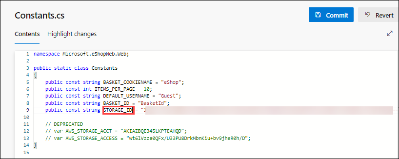
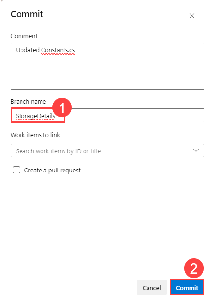
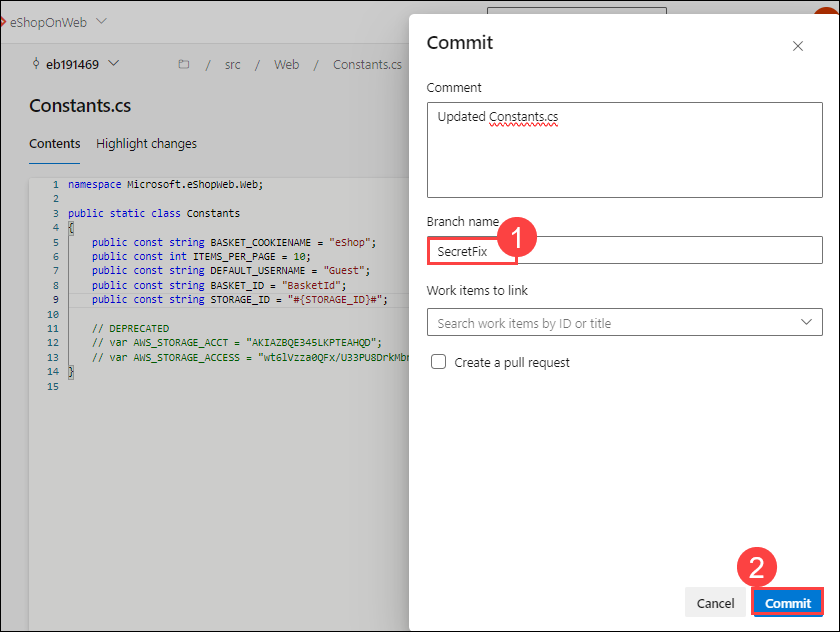
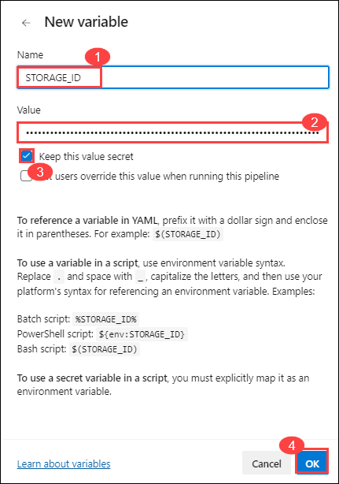

## Lab 02: Secret Scanning 


Secret Scanning scans your codebase and other resources to identify potential secrets that may have been inadvertently committed and provides alerts to mitigate the risk of exposure. Push protection also prevents any credentials from being leaked in the first place.

Once this is toggled on, it starts off a background scan of this repo and looks for exposed credentials. The scan doesn't just look at the tip of the main since attackers would look through all the branches and the entire commit history.

### Task 1: Viewing alerts of repository 

The Advance Security Alert hub is where all alerts are raised and where we gain insights, specifically under the category of Secrets. When a secret is found, you can click on it to access more information. The secret may be located in different places, including various commits. 

1.	Go to the **Repos** tab and click on the **Advanced Security** menu item at the bottom.

     

2.	Click on **Secrets** to see a list of all the exposed Secrets alerts that have been found. This includes the Alert and Introduced date. Click on the Microsoft Azure Storage account access key identifiable... to see more details about the alert and what you can do to clean up the secret.

  	 

4.	Notice this includes the Recommendation, Locations found, Remediation Steps, Severity, and the Date it was first introduced. We can easily clean this up and dismiss the alert.

  	 

### Task 2: Protection of Repositories (Stop the Leak) 
Once a credential touches the repo, it's too late. Hackers might have already exploited it. The only way forward is to eliminate these leaks permanently and to find all the places they're actually being used in production.

 **Note:** Good news, GHAzDO focuses on preventing this in the first place. Bad news, these need to be manually fixed. There isn't an Easy Button.

#### Push Protection

Push Protection helps protect your repository by preventing unauthorized or malicious code from being pushed to your repository's branches.

#### Updating Secrets:

You can follow these steps to update a file. 

1.	While viewing the alert details, click on the line of code, _Constants._ _cs_.
    


2.	Click Edit to edit the file. This will open up the code editor and highlight the exact location of the secret. In this case, it's in the .cs    file.

3.	On line 9, update the variable name as "STORAGE_ID". 
    
    

4.	Click Commit to save changes. Enter StorageDetails for the branch name and check Create a pull request, then click Commit again.

    

5.	The commit was rejected because the repository has both secret and branch protection enabled. This is a good thing! It's preventing us from checking in the exposed secret. Let's fix this.
    

    > **Note:** the code went up to the server, analyzed, then rejected, not stored anywhere. Using Secret push scanning, it catches secrets right before it becomes a problem

    > **ProTip!** This can't happen during a Pull Request. Once the code has pushed into topic branch, it's too late. PR analysis is best for dependency scanning but not secret push scanning, they are different.

#### Fixing Exposed Secrets

You can follow these steps to fix the exposed secret. 
1.	Click Cancel to return to the code editor.

    > **Note**: This scenario is all too common. A developer is testing an application locally and needs to connect to a database, so what do they do? Of course, just put the connection string in the appsettings.json file. They forget to remove it before checking in the code. Now the secret is exposed in the repo, and not just the tip. The exposed credential will still be in the history. This is a huge security hole!

1.	On line 9, copy the STORAGE_ID value and note it down in a notepad. Now, replace this value with        #{STORAGE_ID}#.

    

1.	Click Commit to save changes. Enter SecretFix for the branch name and link a work item.

    

    > **Note:** This step is necessary since the main branch is protected by a pull request pipeline

1.	Next, we need to update the build pipeline to add a variable. Click on Pipelines and click on eShoponWeb.

10.	Click on *Edit* to edit the pipeline. Change to the SecretFix branch.
    
 
11.	Click on Variables and click + New Variable. Enter STORAGE_ID for the name and paste the URL from Notepad into the value field.
    

12.	Click Keep this value secret to hide the value, then click OK and Save. Next, we need to edit the pipeline and add a new build task to replace the #{STORAGE_ID}# with the actual value.

14.	While still in edit mode, add the following task between the Checkout and Restore tasks, around line 15. This will replace the #{STORAGE_ID}# with the actual value in the src/Web/Constants.cs file.
    ``` YAML

    - task: qetza.replacetokens.replacetokens-taskreplacetokens@5
            inputs:
              targetFiles: '**/*.cs'
              encoding: 'auto'
              tokenPattern: 'custom'
              tokenPrefix: '#{' 
              tokenSuffix: '}#' 
              verbosity: 'detailed' 
              keepToken: false 

    ```
    

23.	Select Commit directly to the SecretFix branch, then click Save.

    

24.	Once the commit is saved, click on Repos, click Pull Requests, and click Create a pull request to merge the changes from branch SecretFix into branch main. 

25.	For the Title, enter the Fixed secret by adding a build token, and click Create. This will run the eShoponWeb pipeline to validate changes. 

26.	Once the eShoponWeb pipeline has been completed, click Approve and Complete.

27.	Change Merge Type to Squash commit and check box Delete SecretFix after merging, to merge changes into the main branch.

    


    > **ProTip!**
    Squash Merge is important. If we just commit, the exposed credential will still be in the history. To avoid this, fix the code, use a Squash Merge, push it to repo, and you're done!

    > **Note**
    The build will run automatically, initiating the secret scanning task, and publishing the results to Advanced Security, and an alert will automatically be closed. However, the exposed issue will still be in the history and must be dismissed.

#### Dismissing Alert
You can follow these steps to dismiss the alert.

1.	Once the pipeline eShoponWeb has been completed, go to the Azure DevOps Advanced Security dashboard and click on Secrets. 

1.	Click on the following item, Microsoft Storage account... to see the exposed secret and how we easily dismiss the alert. 

1.	Click on Close alert to dismiss the alert, select Revoked, then click Close.
    
    

    >**Note**: Once the code is merged into main, GHAzDO starts off a background scan of this repo and looks for exposed credentials. The scan doesn't just look at tip of main either, since attackers would look through all the branches and entire commit history.

4.	Go to the Azure DevOps Advanced Security dashboard and click on Secrets, you will see a list of other exposed Secrets alerts that have been found. 

5.	You will see that the alert Microsoft Storage account... no longer exists, as it is now revoked.

    >**Note**: Anyone with contributor permissions for a repository can view a summary of all alerts for a repository but only project administrators can dismiss Advanced Security alerts.
