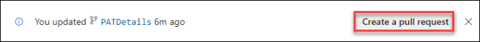
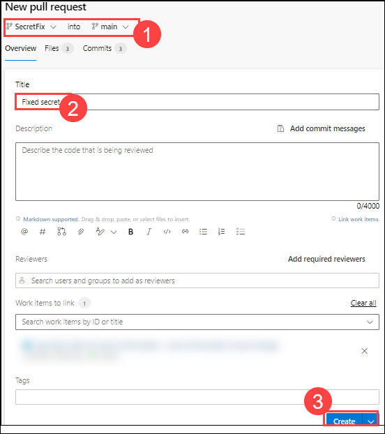

# Lab 02: Secret Scanning 

## Lab Scenario

In this lab, we implement secret scanning in Azure DevOps to identify and mitigate potential exposures. We learn to view, fix, and dismiss secret scanning alerts, enhancing security measures within their development environment.

## Lab Objectives

In this lab, you will perform the following:

- Task 1: Viewing alerts of repository
- Task 2: Fixing secret scanning alerts
- Task 3: Dismissing secret scanning alerts
  
## Estimated Timing: 30 minutes

## Architecture Diagram

  
  
Secret Scanning scans your codebase and other resources to identify potential secrets that may have been inadvertently committed and provides alerts to mitigate the risk of exposure. Push protection also prevents credentials from being leaked in the first place.

Once this is toggled on, it starts off a background scan of this repo and looks for exposed credentials. The scan doesn't just look at the tip of the main, since attackers would look through all the branches and the entire commit history.

### Task 1: Viewing alerts of repository 

The Advanced Security Alert Hub is where all alerts are raised and where we gain insights, specifically under the category of Secrets. When a secret is found, you can click on it to access more information. The secret may be located in different places, including various commits. 

1. Go to the **Repos** tab and click on the **Advanced Security** menu item at the bottom.

   

1. Click on **Secrets** to see a list of all the exposed secret alerts that have been found. This includes the alert and introduced dates. Click on the **Azure DevOps personal access token(PAT)** to see more details about the alert and what you can do to clean up the secret.

   

1. Notice that this includes the Recommendation, Locations found, Remediation steps, Severity, and the Date it was first introduced. We can easily clean this up and dismiss the alert.

   

### Task 2: Fixing secret scanning alerts

Once a credential touches the repo, it's too late. Hackers might have already exploited it. The only way forward is to permanently eliminate these leaks and find all the places they're being used in production.

 **Note:** Good news! GHAzDO focuses on preventing this in the first place. Bad news! These need to be manually fixed. There isn't an easy button.

#### Push Protection

Push Protection helps protect your repository by preventing unauthorized or malicious code from being pushed to your repository's branches.

#### Updating Secrets:

You can follow these steps to update a file. 

1. While viewing the alert details, click on the line of code, _Constants._ _cs_.

    

1. Click on **Edit** to edit the file. This will open the code editor and highlight the exact location of the secret. In this case, it's in the .cs file.

1. On line 5, update the variable name to "AZDO_PAT" and click on **Commit** to save changes.
    
     

1. Enter **PATDetails** for the branch name and then click on **Commit** again.

     

1. The commit was rejected because the repository has secret protection enabled. This is a good thing! It's preventing us from checking in on the exposed secret. Let's fix this.
   
    

    > **Note:** The code went up to the server, was analyzed, rejected, and not stored anywhere. Using Secret push scanning, it catches secrets right before they become a problem.

    > **ProTip!** This can't happen during a Pull Request. Once the code has been pushed into a topic branch, it's too late. PR analysis is best for dependency scanning but not secret push scanning. They are different.

#### Bypass push protection

1. Update your comment with **skip-secret-scanning:true** and click **Commit**.

    

    >**Note:** Bypassing flagged secrets isn't recommended because bypassing can put a company’s security at risk. 

1. It will give an option to **Create a Pull request**.

    

#### Fixing Exposed Secrets

You can follow these steps to fix the exposed secret. 

1. Click on **Edit**.

    > **Note**: This scenario is all too common. A developer is testing an application locally and needs to connect to a database, so what do they do? Of course, just put the connection string in the appsettings.json file. They forget to remove it before checking in the code. Now, the secret is exposed in the repo, not just the tip. The exposed credentials will still be in history. This is a huge security hole!

1. On line 5, replace the PAT value with **#{PAT}#**.

    

1. Click on **Commit** to save changes. Enter **SecretFix** for the branch name and link the **Work item** created earlier from the list.

    

    > **Note:** This step is necessary since the main branch is protected by a pull request pipeline.

1. Navigate to **User settings** > **Personal access token**

1. Select the existing token and select **Regenerate** twice and **copy** the token value to the notepad.

    

    

1. Next, we need to update the build pipeline to add a variable. Click on **Pipelines** and select **eShoponWeb**.

    

1. Click on **Edit** to edit the pipeline. Change to the **SecretFix** branch.

     
   
     
 
1. Click on **Variables** and click on **+** New Variable. 

     

1. Enter **PAT** for the name and paste the secret value from Notepad into the value field. Click on **Keep this value secret to hide the value**, then click **OK** and **Save**.

   
   
1. click on **Repos**, click **Pull Requests**, and click on **New pull request** to merge the changes from branch **SecretFix** into branch **main**. 

1. For the title, enter the **Fixed secret** and click on **Create**. This will run the **eShoponWeb** pipeline to validate changes. 

    

    >**Note:** Make sure you add a workitem link from the dropdown created earlier, if it is not added automatically for the pipeline to run successfully.

1. Once the **eShoponWeb** pipeline has been completed, click **Approve**, and then click on **Complete**.

1. Change **Merge Type** to **Squash commit** and check the box **Delete SecretFix after merging**, to merge changes into the main branch.

    

### Task 3: Dismissing secret scanning alerts

You can follow these steps to dismiss the alert.

1. Once the pipeline eShoponWeb has been completed, from the left navigation pane under **Repos**, go to the Azure DevOps **Advanced Security** dashboard and click on **Secrets**. 

1. Click on the following item, **Azure DevOps personal access token(PAT)** to see the exposed secret and how we easily dismiss the alert. 

1. Click on **Close alert** to dismiss the alert. Select **Revoked**, and then click on **Close**.
    
    

    >**Note**: Once the code is merged into the main, GHAzDO starts a background scan of this repo and looks for exposed credentials. The scan doesn't just look at the tip of the main, since attackers would look through all the branches and the entire commit history.

1. Go to the Azure DevOps Advanced Security dashboard, click on **Secrets**, and subsequently click on **View other alerts**. You will see a list of other exposed secret alerts that have been found. 

1. You will see that the alert **Azure DevOps personal access token(PAT)** no longer exists, as it is now revoked.

    >**Note**: Anyone with contributor permissions for a repository can view a summary of all alerts for a repository, but only project administrator and project collection administrator  can dismiss Advanced Security alerts.

## Review
In this lab, you have completed the following:

- Viewed alerts of the repository.
- Fixed secret scanning alerts.
- Dismissed secret scanning alerts.

Click on **Next** to proceed with the next lab.
