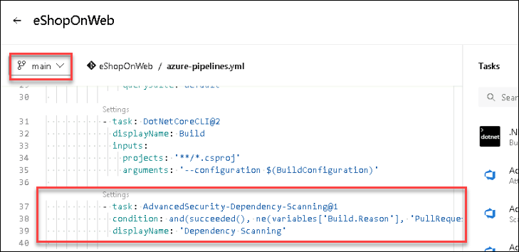
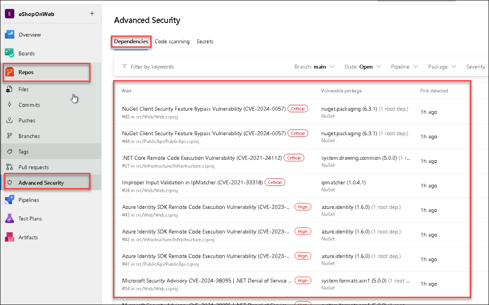
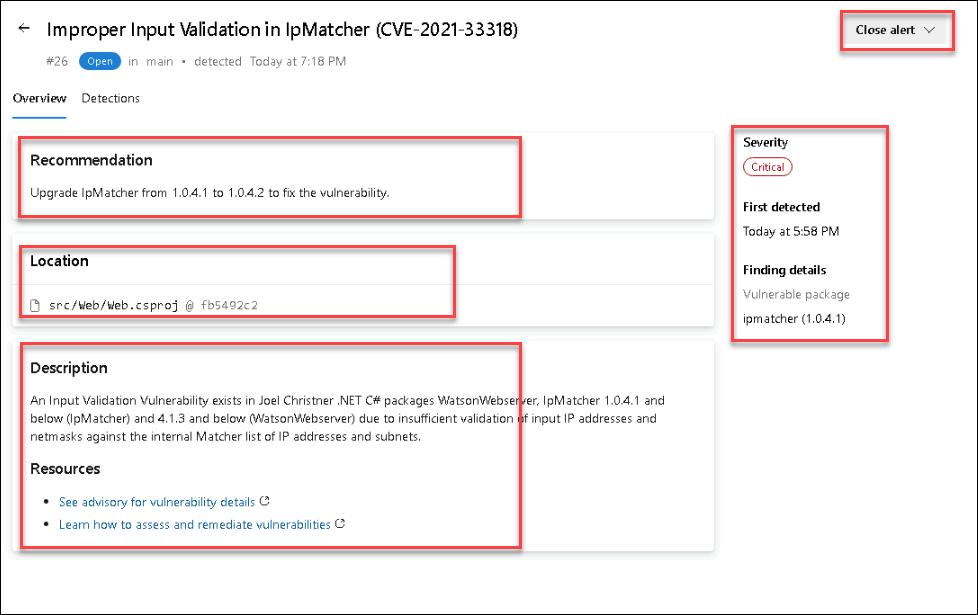
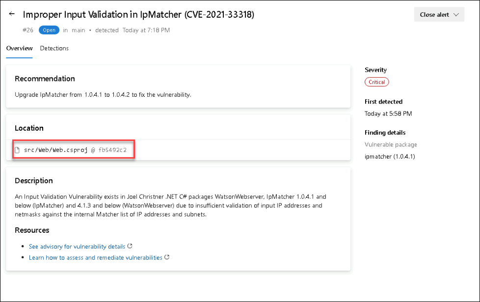
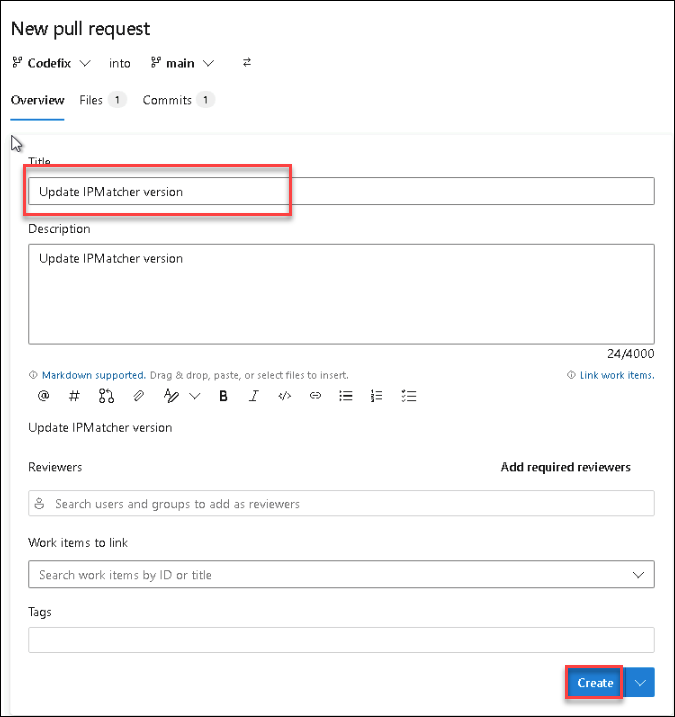
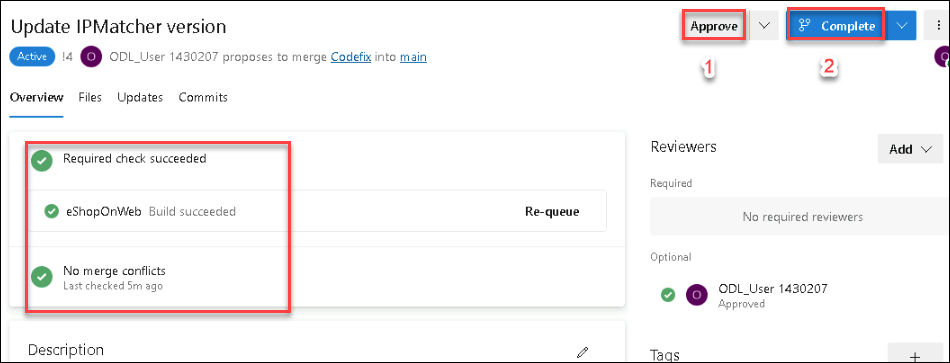
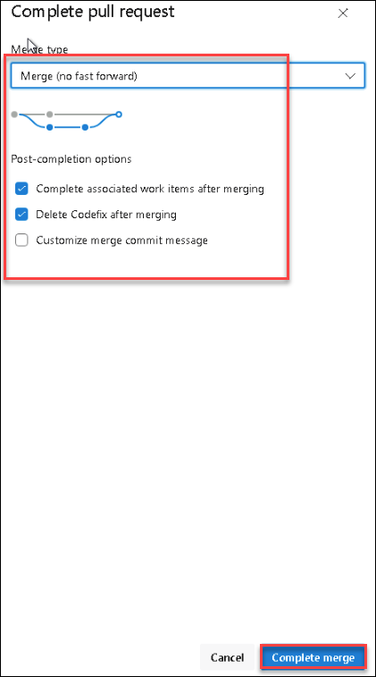

# Lab 03: Dependency Scanning

## Lab Scenario

In this lab, we implement dependency scanning in Azure DevOps to detect and address potential security vulnerabilities in project dependencies. We configure scanning, view alerts, fix identified vulnerabilities, and dismiss resolved alerts, enhancing the overall security posture of their application.

## Lab Objectives

In this lab, you will perform the following:

- Task 1: Setup Dependency Scanning
- Task 2: Viewing alerts of repository
- Task 3: Fixing dependency scanning alerts
- Task 4: Dismissing dependency scanning alerts

## Estimated Timing: 45 minutes

## Architecture Diagram

  

### Task 1: Setup Dependency Scanning

Dependency Scanning scans your project's dependencies, such as libraries, frameworks, and packages, to identify any known security vulnerabilities or outdated versions that may pose a risk to your application.

1. Select the pipeline **eShopOnweb** and click on **Edit**.

    

1. Locate the task **Advanced Security Dependency Scanning** (AdvancedSecurity-Dependency-Scanning@1) which is already included in the YAML pipeline file.

    ```
           - task: AdvancedSecurity-Dependency-Scanning@1
             condition: and(succeeded(), ne(variables['Build.Reason'], 'PullRequest'))
             displayName: 'Dependency Scanning''
     ```

    

1. You don't have to **Run** the pipeline to save time and its completly optional as we have already executed the pipeline in the previous task, which will have already set the dependency scanning.

    

   > **Note:** If you are running the pipeline please wait untill it gets completed and then move to next task, usually it takes about 5 minutes to complete the task. 

### Task 2: Viewing alerts of repository

1. Go to the **Repos** tab and click on the **Advanced Security** menu item at the bottom.

1. Click on **Dependencies** to see a list of all the dependencies alerts that have been found. This includes the alert, vulnerable package, and first detected date. We can easily clean up the dependencies.
   

#### Dependency Scanning Alert Details

1. Click on the item ***Improper Input Validation in IpMatcher...*** to see the details about this alert.

    > **Note:** You can filter the keywords in **Filter by Keywords** box.

1. This includes the Recommendation, Locations found,  Description, Severity, and the Date it was first detected. We can easily clean up the dependencies. 

   

1. You can also view the code that triggered the alert and what build detected it.

1. Click on **Detections** to see the different builds that detected this alert.

   

   > **Note:** When a vulnerable component is no longer detected in the latest build for pipelines with the dependency scanning task, the state of the associated alert is automatically changed to closed. To see these resolved alerts, you can use the **State filter** in the main toolbar and select **Closed**.


#### Understanding Dependency Alerts

In your repository, there are two types of dependencies: direct and transitive (also known as indirect).

- **Direct dependencies** are components of your project.

- **Transitive dependencies** are components used by direct dependencies.


### Task 3: Fixing dependency scanning alerts

In Azure DevOps, Fixing dependency scanning alerts involves updating the affected dependencies to secure versions, testing the changes, and deploying the updates to address identified vulnerabilities.
You can follow the below recommended steps to manually update dependencies.

When a Dependency Alert is created in Azure DevOps Advanced Security, it will contain details about the vulnerability and steps you can take to resolve it.

1. Select the Start menu and search for **Visual Studio 2022**. Select **Visual Studio 2022** to run it.

1. **Sign in** to Visual Studio 2022 with the credentials email address: **<inject key="AzureAdUserEmail"></inject>** and Password:**<inject key="AzureAdUserPassword"></inject>** and later select **Start Visual studio**.

    

    

1. In the meantime Visual studio starts, Navigate back to Azure DevOps portal to view the alert, go to the Azure DevOps Advanced Security dashboard, scroll down, and click on the alert  **Improper Input Validation in IpMatcher....**

1. Review Recommendation, Location, Description, and Severity to understand the vulnerability and how to resolve it.
   
   
  
1. Click on the **Locations** to see the code that triggered the alert, this will open the code file from where the alert has triggered. You can explore the code and understand the used package has triggered an alert and we are not using the latest package version. 

    
   
1. Copy the repo URL from Azure DevOps by navigating to the **Repos** section from the left navigation pane, clicking on **Clone** to get the repo URL, and taking note of it in the notepad.

    

    

1. Now navigate back to VS 2022 and Select **Clone a repository** under **Get Started** and enter the **clone URL** under **Repository location**, which was copied earlier. Ensure the Path is **C:\Users\azureuser\Source\Repos\eShopOnWeb** and then click on **Clone**.	

    

    

1. While cloning the repo, Git-credentials Manager pops up. Enter the **Username:** **<inject key="AzureAdUserEmail"></inject>** and **Password:** **<inject key="AzureAdUserPassword"></inject>**

1. Create a new branch to make the necessary changes. Select the **main (1)** branch from the lower right corner and select **New branch (2)**.

    

    > **Note:** This step is necessary since the main branch is protected by a pull request pipeline.

1. On **Create a new branch** window, enter **Codefix (1)** and click on **Create (2)**.

    

1. From the **Solution Explored**, Double-click the **eShopOnWeb.sln** solution file.  

    

1. Once the source code is opened in Solution Explorer, navigate to the **Dependencies** section under **(SRC>Web)Web.**.

    

1. Right-click on **Dependencies** and choose **Manage Nuget Packages...**.

    

1. Click on **IpMatcher**, and you will be able to see a warning regarding the vulnerability in that specific version.

    

1. Change the version as per the suggestion, which is **1.0.4.2** and select **Update**.

    

1. On **preview changes** pop-up, click on  **Apply**.

   

1. Switch to the **GitChanges (1)** tab from bottom and select **Configure (2)** to add the username and email address that are required before committing changes, the details would be already available.

    

1. Click on **Save**.

    

1. Add the required **description** as **Update IPMatcher version** and select the **Commit All and Push** option to push the changes to Origin.

    

    >**Note:** On the **Commit** pop-up select **Save and commit**.

1. Navigate to **Azure DevOps**, click on **Repos**, select **Pull requests** and select **Create a pull request** to push the commits from **codefix** to the **main**.

   

1. On the **New pull request** page, and click on **Create (2)**.

    

    > **Note:** The build will run automatically, initiating the dependency scanning task and publishing the results to Advanced Security. The alert will then automatically close.

1. Once the **eShoponWeb** pipeline has been completed, click on **Approve (1)** and then click on **Complete (2)**, 

   

1. On Complete pull request page, leave all option to default and click on **Complete merge** button to merge changes into the main branch.

   


### Task 4: Dismissing dependency scanning alerts

1. Navigate to the **pipelines section** and wait for it to complete. It might take up to 10 minutes.

1. Once the pipeline has been completed, **eShopOnWeb**, go to the Azure DevOps Advanced Security dashboard and click on **Dependencies**.

1. You will see that the alert **Improper Input Validation in IpMatcher....** no longer exists. It is now closed, if you want to see the filter in closed state, select the State filter and changes it to Closed.

   > **Note:** This is a great way to ensure you are using the latest and greatest versions of your dependencies and also to ensure you are not using any vulnerable versions.

## Review
In this lab, you have completed the following:
- Setup Dependency Scanning.
- Viewed alerts of the repository.
- Fixed dependency scanning alerts.
- Dismissed dependency scanning alerts.

Click on **Next** to continue with the next lab.
