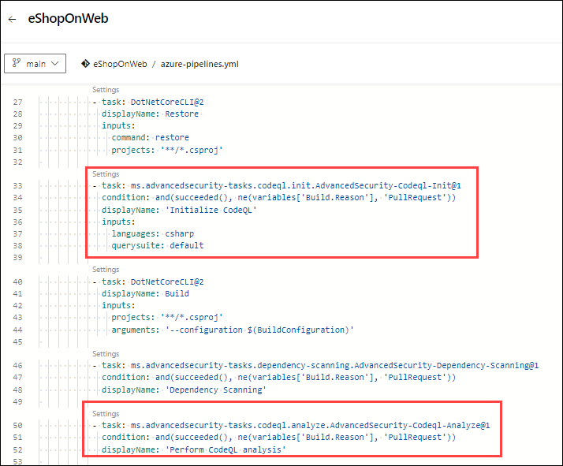

# Lab 04: Code scanning

## Lab Scenario

In this lab, we set up code scanning in Azure DevOps using GitHub Advanced Security to analyze code for security vulnerabilities and errors. We will review code scanning alerts, fix identified issues in the code, and dismiss resolved alerts, thereby enhancing the security of their codebase.

## Lab Objectives

In this lab, you will perform the following:

- Task 1: Setup Code Scanning
- Task 2: Review Code Scanning Alert (Gain Insights)
- Task 3: Fixing the Code to resolve the alert
- Task 4: Dismissing the code scanning alerts 

## Estimated Timing: 45 minutes

## Architecture Diagram

  

### Task 1: Setup Code Scanning

Code scanning in GitHub Advanced Security for Azure DevOps lets you analyze the code in an Azure DevOps repository to find security vulnerabilities and coding errors. Any problems identified by the analysis are raised as an alert. Code scanning uses CodeQL to identify vulnerabilities.

1. Select the pipeline **eShopOnweb**.

   

1. Locate the tasks related to **Advanced Security Code Scanning** that are already included in the YAML pipeline file.

   
 
1. Do not run the pipeline. The code scanning setup has already been initiated, along with dependency scanning performed in the previous lab.

### Task 2: Review Code Scanning Alert (Gain Insights)

1. Go to the **Repos** tab and click on the **Advanced Security** menu at the bottom.

1. Click on **Code scanning** to see a list of all the code scanning alerts that have been found. This includes the alert, vulnerable code details, and first detected date.

#### Code scanning Alert Details

1. Click on the item ***Uncontrolled command line...*** to see the details about this alert.

1. This includes the Recommendation, Locations found, Description, Severity, and the Date it was first detected. We can easily fix this threat. 

   

1. You can also view the code that triggered the alert and what build detected it.
   
1. Click on **Detections** to see the different builds that detected this alert.

   

    **ProTip!** When a vulnerable component is no longer detected in the latest build for pipelines with the dependency scanning task, the state of the associated alert is automatically changed to Closed. To see these resolved alerts, you can use the **State filter** in the main toolbar and select **Closed**.

### Task 3: Fixing the Code to resolve the alert

1. This is simple to fix using parameters in the dynamic SQL described in the remediation steps.

1. Click on **Locations found** to see the code that triggered the alert.

   

1. Click on the **Edit** button to edit the file. Line number 23 is highlighted here. 

1. The value of __{drive}__ is getting highlighted from line number 23.

    

1. Instead of getting the value of 
__{drive}__ using a query, we can directly define it as __C__ for the string drive variable in the line 20.
    ```C#
    string drive = "C";
    ```

    

1. Click on **Commit** to save changes. Enter **Fixalert** for the branch name and link any work item. Check **Create a pull request**, and then click on **Commit** again.

    

    > **Note:** This step is necessary since the main branch is protected by a pull request pipeline.

1.	Click on the **Create a new pull request** page to merge the changes into the main branch.

1. Make sure all the policies are followed and complete the pull request.

1.  This will run the **eShopOnWeb** pipeline.

    > **Note**: The build will run automatically, initiating the code scanning task and publishing the results to Advanced Security.

### Task 4: Dismissing the code scanning alerts 

Once after the completion of the build, if you navigate to the __Code scanning__ section of __Advanced Security__. You will find the alert is closed automatically.

## Review
In this lab, you have completed the following:

- Setup Code Scanning.
- Reviewed Code Scanning Alert (Gain Insights).
- Fixed the Code to resolve the alert.
- Dismissed the code scanning alerts. 

Click on **Next** to proceed with the next lab.
