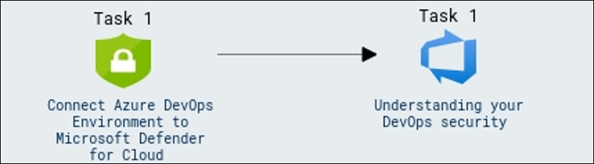
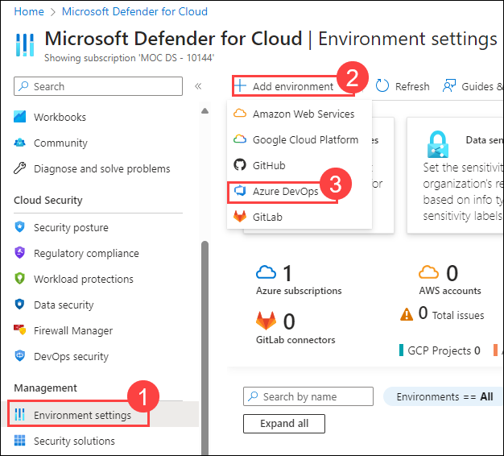
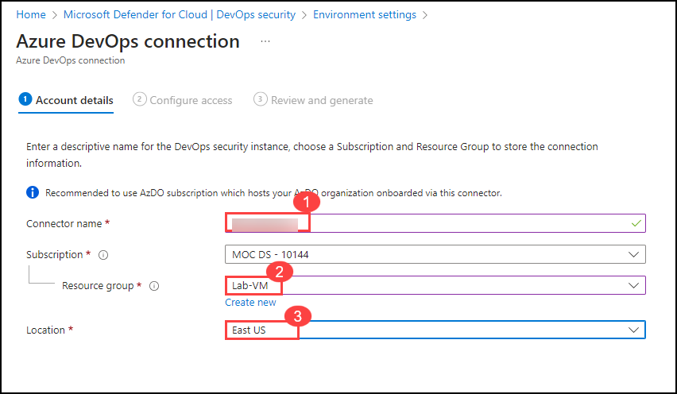
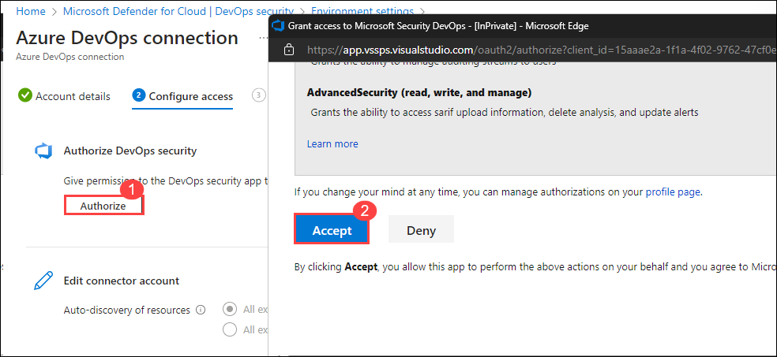
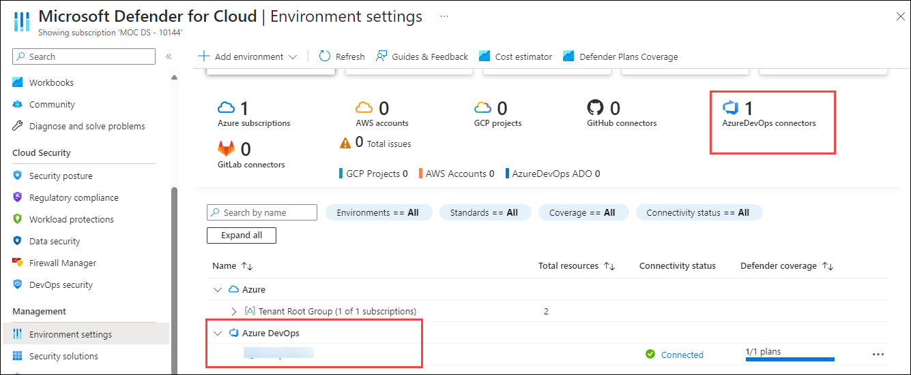
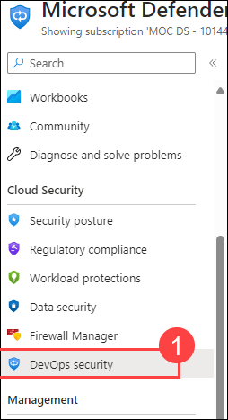
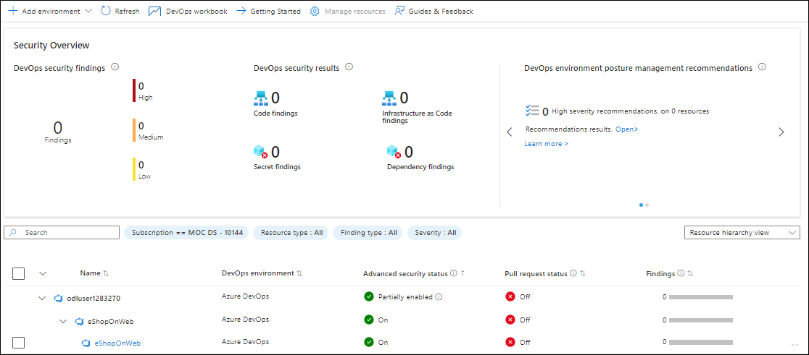

# Lab 05: Microsoft Defender for Cloud DevOps security

## Lab Scenario

In this lab, we connect their Azure DevOps environment to Microsoft Defender for Cloud to enhance DevOps security. we will explore the DevOps security findings and inventory provided by Microsoft Defender for Cloud to review their security posture.

## Lab Objectives

In this lab, you will perform the following:

- Task 1: Connect Azure DevOps Environment to Microsoft Defender for Cloud
- Task 2: Understanding your DevOps security

## Estimated Timing:30 minutes

## Architecture Diagram

  

### Task 1: Connect Azure DevOps Environment to Microsoft Defender for Cloud

1. Sign in to the Azure portal.

1. Go to Microsoft Defender for Cloud > Environment settings.

1. Select Add environment.

1. Select Azure DevOps.

    

1. On **Azure DevOps Connection** page, under Account details, provide the below settings.

   | Setting  | Value |
   -----------|---------
   | Connector name | AzureDevopsconnector |
   | Resource group | LabVM |
   | Region | Select any supporting region |

    

1. Select **Next: Configure access**

1. Select **Authorize**. Ensure you're authorizing the correct Azure Tenant using the drop-down menu in Azure DevOps and by verifying you're in the correct Azure Tenant in Defender for Cloud.

1. In the popup dialog, read the list of permission requests, and then select **Accept**.

    

1. Leave all other settings as default.

1. Select **Next: Review and generate**.

1. Review the information, and then select **Create**.

1. Wait for sometime, to view the connector in the Environment settings page

    

### Task 2: Understanding your DevOps security

1. Navigate to the **DevOps Security** under Cloud security

    

1. The DevOps security findings and DevOps Inventory table is listed in the page which helps to review the security posture of DevOps.

    

   >**Note:** It might take time to reflect the real-time status of **Advanced Security Status**.

## Review
In this lab you have completed the following:

-  Connected Azure DevOps Environment to Microsoft Defender for Cloud
-  Understood your DevOps security

