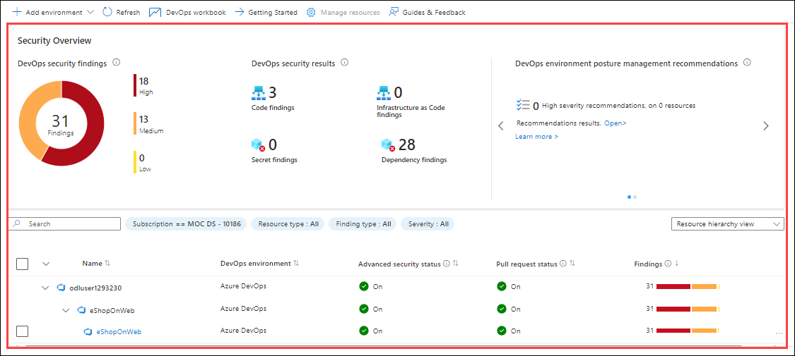

# Lab 05: Microsoft Defender for Cloud DevOps security 
### Estimated Duration: 30 minutes

In this lab, we connect the Azure DevOps environment to Microsoft Defender for Cloud to enhance DevOps security. We will explore the DevOps security findings and inventory provided by Microsoft Defender for Cloud to review their security posture.

## Lab Objectives

In this lab, you will perform the following:

- Task 1: Connect Azure DevOps Environment to Microsoft Defender for Cloud
- Task 2: Understand your DevOps security

<!-- ## Architecture Diagram

   -->

### Task 1: Connect Azure DevOps Environment to Microsoft Defender for Cloud

1. Open a new tab, navigate to `portal.azure.com` and sign in using the below credentials.

   - **Email/Username:** <inject key="AzureAdUserEmail"></inject>

   - **Password:** <inject key="AzureAdUserPassword"></inject>

1. Search and select **Microsoft Defender for Cloud** from the portal.

    

1. In the left navigation pane, expand the Management section and  select **Environment settings (1)**.Click on **+ Add environment (2)**  and choose **Azure DevOps (3)**.

    

1. On the **Azure DevOps Connection** page, under **Account details**, provide the below settings, and select **Next: Select Plans >** **(4)**.

   | Setting  | Value |
   -----------|---------
   | Connector name | **AzureDevopsconnector (1)** |
   | Subscription | Choose the default subscription |
   | Resource group | **Lab-VM (2)** |
   | Location | Select the region where you created the Azure DevOps organization. **(3)** |

    

    >**Note:** To check the region of your Azure DevOps organization, navigate to **Azure DevOps > Organization Settings**. There, you will find the region where it was created.

1. On the Select Plans page, keep everything as default and click on **Next: Configure Access**.

1. Select **Authorize** and ensure you're authorizing the correct Azure Tenant by using the drop-down menu in Azure DevOps and verifying you're in the correct Azure Tenant in Defender for Cloud. In the popup dialog, read the list of permission requests and then select **Accept**.

    

1. Leave all other settings as default. Select **Next: Review and generate**, review the information, and then select **Create**.

1. Wait for some time to view the connector on the **Environment settings** page.

    

    >**Note:** It can take upto 2-3 hours for the status to change from In progress to Connected.

> **Congratulations** on completing the task! Now, it's time to validate it. Here are the steps:
> - If you receive a success message, you can proceed to the next task.
> - If not, carefully read the error message and retry the step, following the instructions in the lab guide. 
> - If you need any assistance, please contact us at **cloudlabs-support@spektrasystems.com**. We are available 24/7 to help you out.

<validation step="c52850e5-7c62-4d01-a624-175043de84b6" />

### Task 2: Understanding your DevOps security (Read-Only)

This task has been set to Read-Only because addressing the DevOps security findings in Microsoft Defender for Cloud will take approximately 8 hours.

1. Navigate to **DevOps Security** under **Cloud Security**.

    

1. The **DevOps security findings** and **DevOps security results** are listed on the page, which helps to review the DevOps security posture.

    

   >**Note:** It might take upto 8hrs to reflect the real-time status.

1. Navigate to **DevOps workbook** and change the toggle to **Yes**, which provides an overview of the tabs provided below

    

    

1. Navigate to the **Code (1)** tab and scroll down, click on the **Severity (2)** section to open the individual findings, and click on **Information (3)** which in turn provides detailed findings and the issue location.

    

1. Similarly, navigate to the **OSS Vulnerabilities** tab and identify the issues, then take note of the recommendations provided to resolve the issues.

    

 Please feel free to go through these links for further understanding: [Application Security](https://info.microsoft.com/US-DevOps-VDEO-FY24-02Feb-12-GitHub-and-AI-A-Powerful-Duo-for-Application-Security-Testing-SRGCM11732_LP01-Registration---Form-in-Body.html) and [Email Reactor](https://developer.microsoft.com/en-us/reactor/series/S-1311/?wt.mc_id=promotional_S-1311_email_reactor)

## Review
In this lab, you have completed the following:

-  Connected Azure DevOps Environment to Microsoft Defender for Cloud.
-  Understood your DevOps security.
