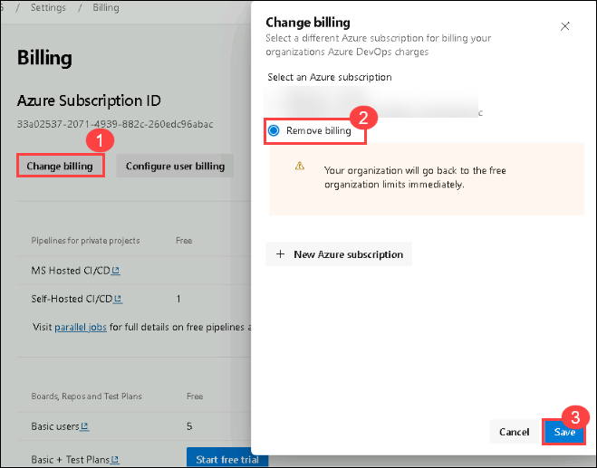

# Lab 06: Remove Subscription from DevOps billing

## Lab Scenario

In this lab, we connect your Azure DevOps environment and remove the subscription from billing. This process helps manage our organization's billing settings effectively.

## Lab Objectives

In this lab, you will perform the following:

- Task 1: Remove Subscription from DevOps billing

## Estimated Timing: 10 minutes

### Task 1: Remove Subscription from DevOps billing

1. On the **Azure DevOps** page at button left click on **Organization settings** then select **Billing** (opening this screen takes a few seconds).

   

1. From the left navigation pane select **Billing** and click **Change billing** on the right-hand side of the screen select the **Remove billing** listed and click **Save** to remove the subscription which is linked with the organization.

   

## You have successfully completed the lab.
