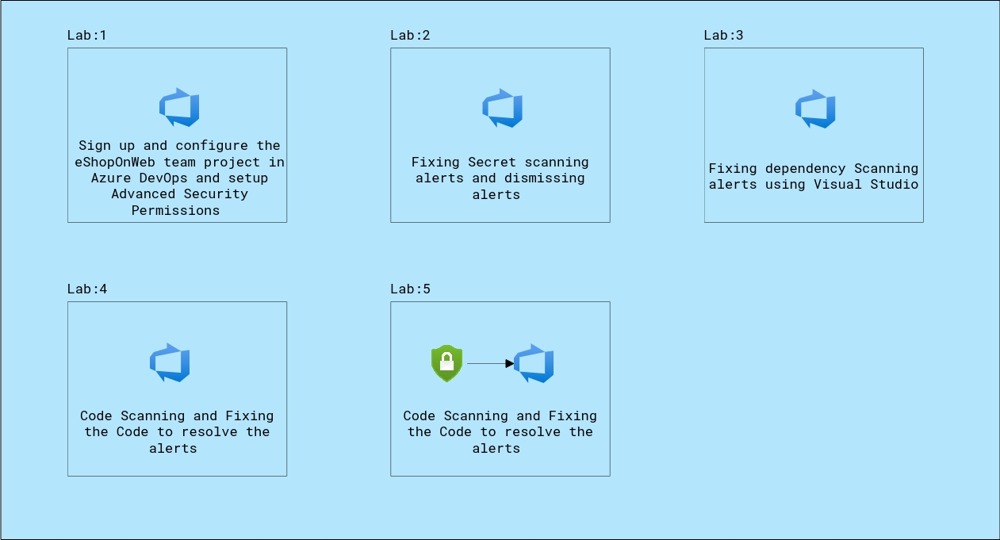

# Mitigating Vulnerabilities with GitHub Advanced Security and Azure DevOps
### Overall Estimated Duration: 4 Hours
## Overview

GitHub Advanced Security (GHAS) and Azure DevOps (ADO) are powerful tools that can enhance your development workflow and improve the security of your codebase. Integrating GHAS with ADO leverages the strengths of both platforms to create a more secure and efficient development process.

## Pre-requisites
## Architecture
## Architecture Diagram

## Explanation of Components
The architecture for this lab involves the following key components:

- **Azure DevOps**: Azure DevOps is a set of development tools and services provided by Microsoft, which offers:
    1. **Azure Repos**: A set of version control tools to manage your code.
    2. **Azure Pipelines**: Continuous integration and continuous delivery (CI/CD) that works with any language, platform, and cloud.
    3. **Azure Boards**: Agile planning tools to track work with Kanban boards, backlogs, team dashboards, and custom reporting.
    4. **Azure Test Plans**: Automated and manual testing tools.
    5. **Azure Artifacts**: Package management for Maven, npm, NuGet, and more.

## Integrating GitHub Advanced Security with Azure DevOps

Integrating GHAS with ADO can be done through various approaches, combining the security features of GitHub with the powerful development and deployment capabilities of Azure DevOps.

1. **Code Scanning with CodeQL**: Code scanning is also a pipeline-based scanning tool where results are aggregated per repository.
2. **Secret Scanning**: Secret scanning push protection and repository scanning are automatically enabled when you turn on Advanced Security. You can enable or disable secret push protection from the repository settings page.
3. **Dependency scanning**: Dependency scanning is a pipeline-based scanning tool. Results are aggregated per repository. It's recommended that you add the dependency scanning task to all the pipelines you'd like to be scanned.

## Benefits of Integration

- **Enhanced Security**: By integrating GHAS with ADO, you can catch vulnerabilities early in the development process and ensure that your code is secure before it is deployed.
- **Automated Workflows**: Automate security checks and balances within your CI/CD pipeline to reduce manual effort and improve efficiency.
## Getting Started with Your GitHub Advanced Security with Azure DevOps
 
Welcome to your GitHub Advanced Security with Azure DevOps workshop! We've prepared a seamless environment for you to explore and learn about enabling, configuring, and managing security features across various tasks, such as secret scanning, dependency scanning, and code scanning. Let's begin by making the most of this experience:
 
## Accessing Your Lab Environment
 
Once you're ready to dive in, your virtual machine and lab guide will be right at your fingertips within your web browser.
 
  

### Virtual Machine & Lab Guide
 
Your virtual machine is your workhorse throughout the workshop. The lab guide is your roadmap to success.
 
## Exploring Your Lab Resources
 
To get a better understanding of your lab resources and credentials, navigate to the **Environment/ Environment Details** tab.
 
  
 
## Utilizing the Split Window Feature
 
For convenience, you can open the lab guide in a separate window by selecting the **Split Window** button from the top right corner.
 
  
 
## Managing Your Virtual Machine
 
1. Feel free to start, stop, or restart your virtual machine as needed from the **Resources** tab.

   
  
1. You can use the **Previous(1)** and **Next(2)** buttons to navigate through the lab guide.

   -1.png)

## Support Contact

The CloudLabs support team is available 24/7, 365 days a year, via email and live chat to ensure seamless assistance at any time. We offer dedicated support channels tailored specifically for both learners and instructors, ensuring that all your needs are promptly and efficiently addressed.

Learner Support Contacts:

- Email Support: cloudlabs-support@spektrasystems.com
- Live Chat Support: https://cloudlabs.ai/labs-support

Now, click on **Next** from the lower right corner to move on to the next page.